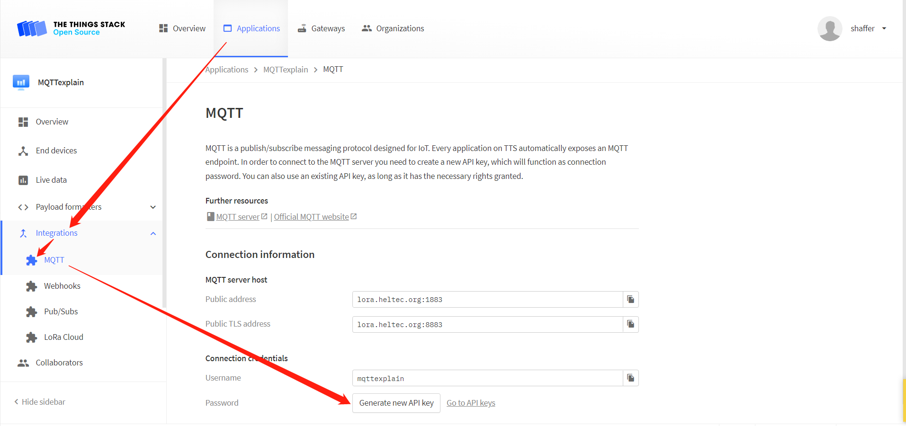
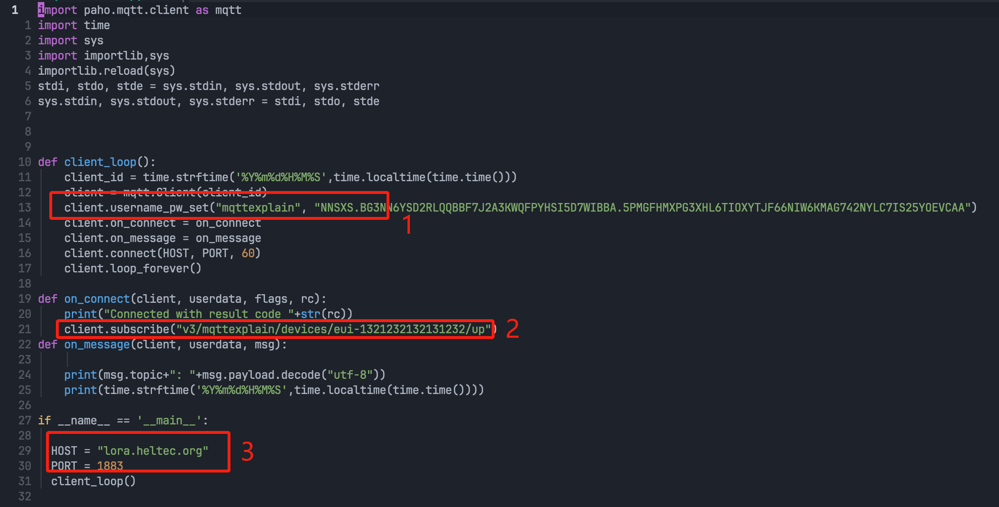
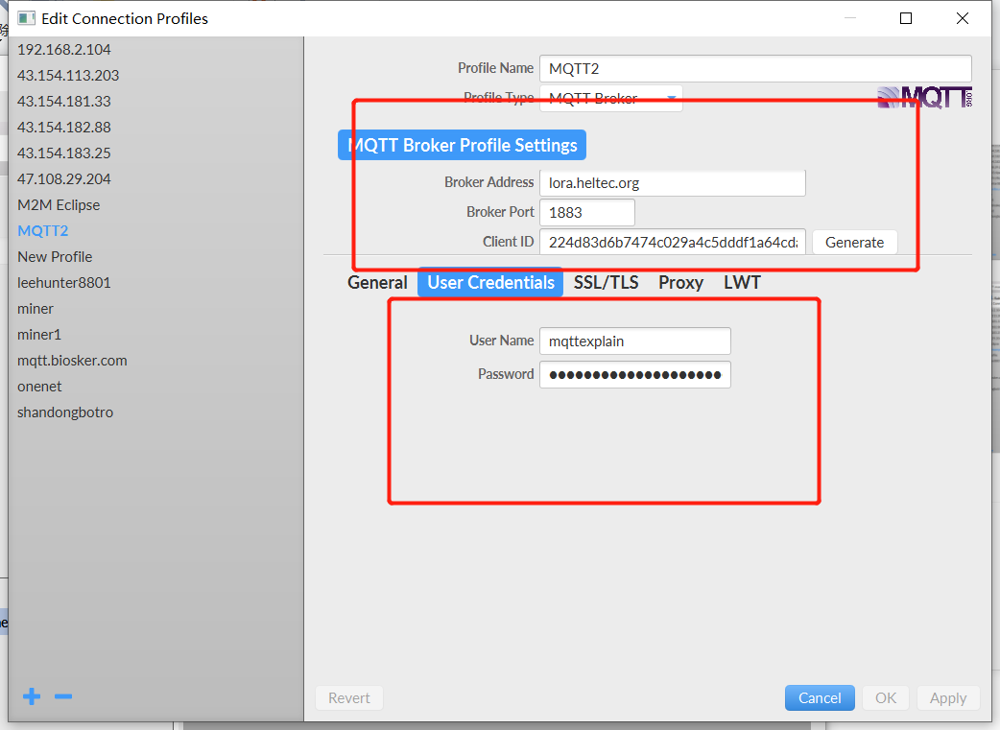

# How to Subscribe MQTT Messages from LoRa Server

## Overview

In the LoRaWAN application framework, [MQTT](https://mqtt.org/) is wildly used. For example, your LoRa node devices send sensor data to a gateway and the gateway forward these data to a cloud server, how can we get these sensor data from the cloud server?

The purpose of this article is to provide some examples of how to get MQTT messages from a cloud servers. Hope these examples can provide some reference or make sense to your application.

:::tip
The four keys to success MQTT subscription: 1. Host address, 2. Host port; 3. user name/pass word, 4. MQTT Topic.
:::

## Connect the node to the server

Make sure your node is connected to the server through the gateway and is working properly.

Take our official server as an example:[lora.heltec.org](https://lora.heltec.org/).

The method of node connection connection L service is referred here:

+ ESP32 Series: [Connect "ESP32 + LoRa" to LoRaWAN Server](1);

+ Cubecell Series: [Connect CubeCell to LoRaWAN Server](1);

+ STM Series: [Connect "STM32 + LoRa" to LoRaWAN Server](1).

## Create an MQTT application

After the node successfully connects to the server, press the path shown by the arrow in the figure, click `Application` `integrations` `MQTT` `Generate New API key` in turn to generate password.

Stay on this screen or save this information, which you will need in the MQTT subscription below.

## Subscribe to MQTT topics

- [Via Python](via-python)
- [Via third party application (MQTT.fx)](via-third-party-application-mqtt-fx)

### Via Python

Here is a simple python3 example that can be used to subscribe to MQTT messages from the server.

[mqtt-receiver.py](https://resource.heltec.cn/download/tools/mqtt-reciver.py)

In the simple python example, the content in the three red boxes needs to be modified according to information on your server:

- `username_pw_set` -- [lora.heltec.org](lora.heltec.org) generate: Username + Password.
- `subscribe ` --v3/'username'/devices/'eui-ID'/up, In this example: "v3/mttexplain/devices/eui-1321232132131232/up".
- `HOST` and `PORT` -- [lora.heltec.org](lora.heltec.org) : `Public Adress`.

Run it in a shell with Python3, the content with red line is the data send by node. It's encrypted in BASE64 format 

`python3 mqtt-receiver.py` 

If the example does not run correctly, may be missing related components, install it through the following command.

`sudo pip3 install paho-mqtt python-etcd`

(via-third-party-application-mqtt-fx)=
### Via third party application (MQTT.fx)

There are many useful MQTT subscription and push software on the Internet. This article takes [MQTT.fx](https://mqttfx.jensd.de/index.php) as an example.

- Basic communication can be carried out with the above settings. And then click `Connect`.

- Click `Subscribe` -> `Scan` in turn, and wait for the connected node to transmit data.

- After the node uploads the data, the information will be scanned in the `Scan` column.

- Select one as the subscription information. When there is matching subscription information uploaded, it will be displayed in the data column. The sample subscription is `v3/mttexplain/devices/eui-1321232132131232/up`.

