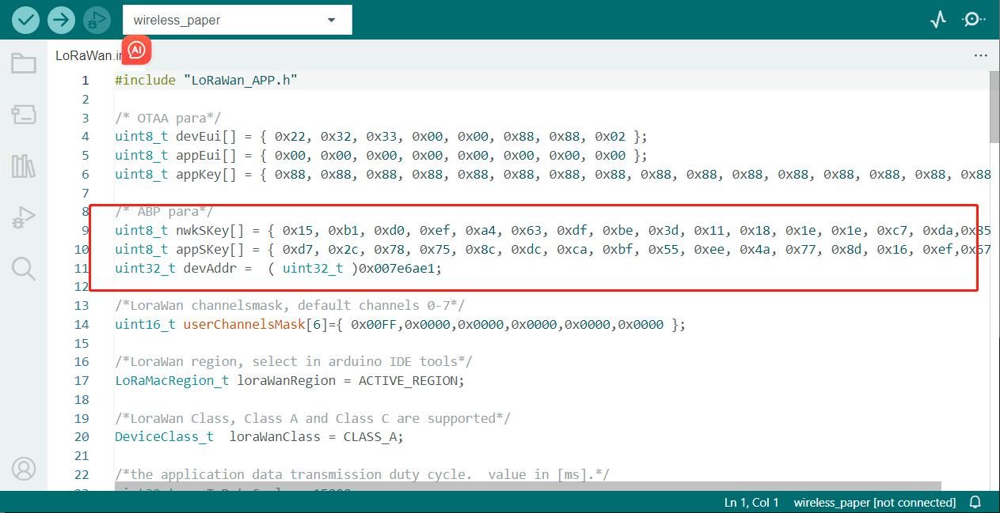
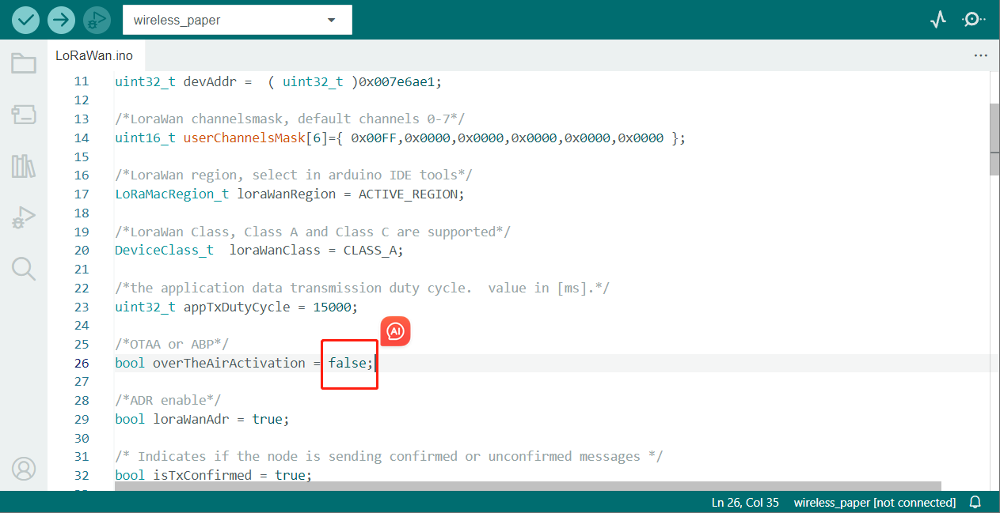
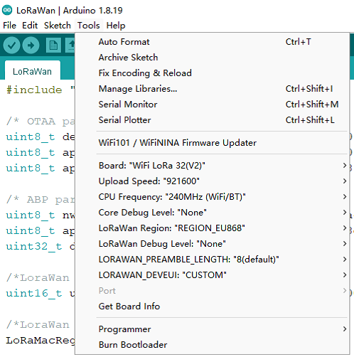
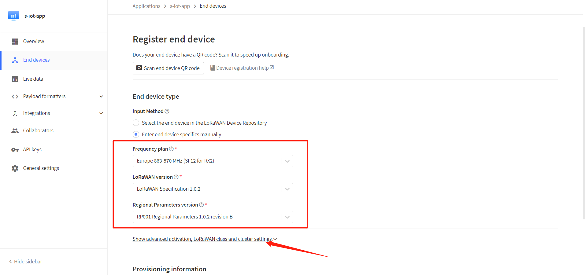
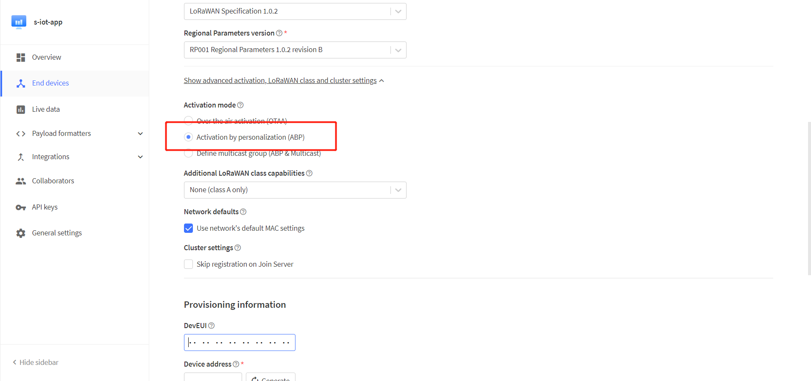
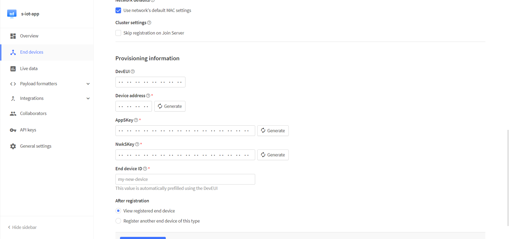
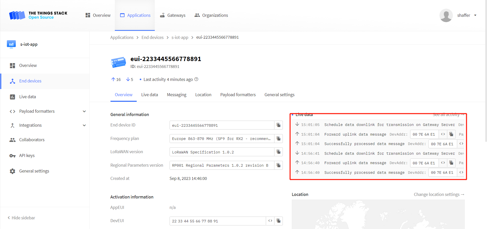
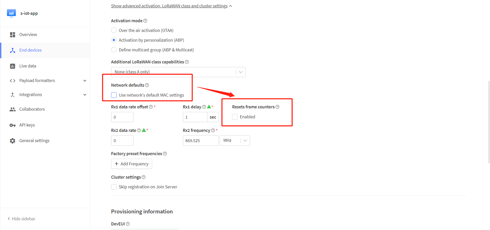

import Tabs from '@theme/Tabs';
import TabItem from '@theme/TabItem';
import styles from '@site/src/css/styles.module.css';
import DocCard from '@theme/DocCard';

<Tabs>
  <TabItem value="configuration-parameters" label="Configuration Parameters" default>

The configuration of LoRaWAN is detailed in various series of instructions, so make sure you read the following links, In this topic, we will focus on the difference between ABP and OTAA.

- [ESP32 Series LoRaWAN](docs/devices/open-source-devices/esp32-series/esp32-quick-start?esp32=lorawan)
- ASR650x Series LoRaWAN
- STM32 Series LoRaWAN
- ufficent IoT LoRaWAN 

## Preparation

The configuration of LoRaWAN is detailed in various series of instructions, so make sure you read the following links, In this topic, we will focus on the difference between ABP and OTAA.

:::tip
HT-AT62 and HT-RA62 please refer to STM32 Series LoRaWAN
:::

## Configure Parameters
Let's take `File -- Examples -- Heltec-Example -- LoRaWAN -- LoRaWAN` as an example.

Enter the parameters to be configured for ABP in the positions marked in the following figure.

Enter `false` as shown below, which means that the code selects ABP.

## Other options
There are some options in the Arduino Tools menu.

:::tip
This section is the same as OTAA, please refer to the link given at the beginning of this topic depending on your device.
:::

</TabItem>
<TabItem value="connect-to-lorawan-server" label="Connect to LoRaWAN server">

Before that, make sure there is a LoRa Gateway active in your [TTN](https://console.thethingsnetwork.org/)/[TTS](https://lora.heltec.org/console) account.

## Register a device

Register a new device in TTN or TTS “Applications” page. Select the frequency plan and LoRaWAN version.At this point, click the location shown in the image below

Select ABP mode.

Notice the option `Network defaults`. The `Resets frame counters` is not enabled by default, which will cause your device to need to be re-registered with the server after power failure, so we recommend you select `Enable`.

Fill in the corresponding parameters in the pop-up options.

:::tip
DevEui is free to fill in the code is not affected, but we recommend that you use the ID provided by the device, so as not to cause confusion.
:::

After registration is complete, if all is well, you will see the device active.

## Important Hints

Please double check the following two things:

1. The LoRaWAN parameters is the same as server!
2. The listening frequency of your LoRa Gateway is the same as ESP32 LoRa node's sending frequency. We strictly follow [LoRaWAN™ 1.0.2 Regional Parameters rB](https://resource.heltec.cn/download/LoRaWANRegionalParametersv1.0.2_final_1944_1.pdf).

</TabItem>
</Tabs>