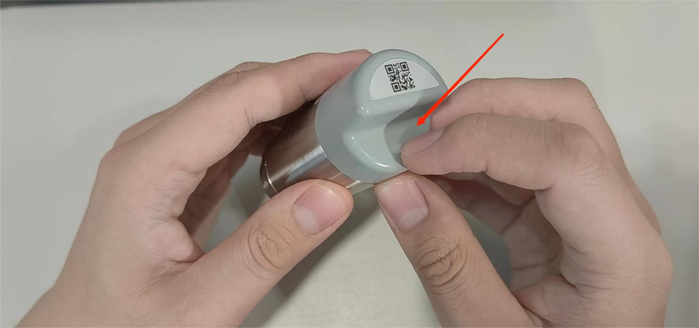
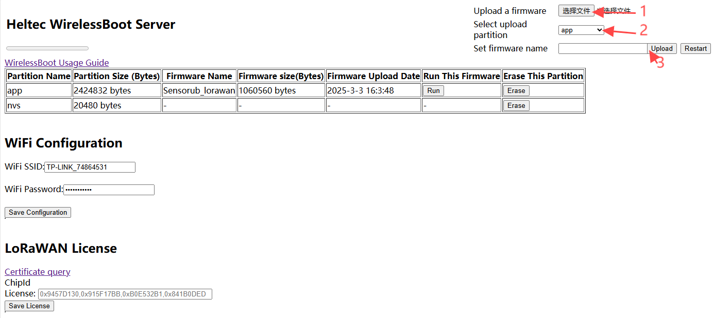
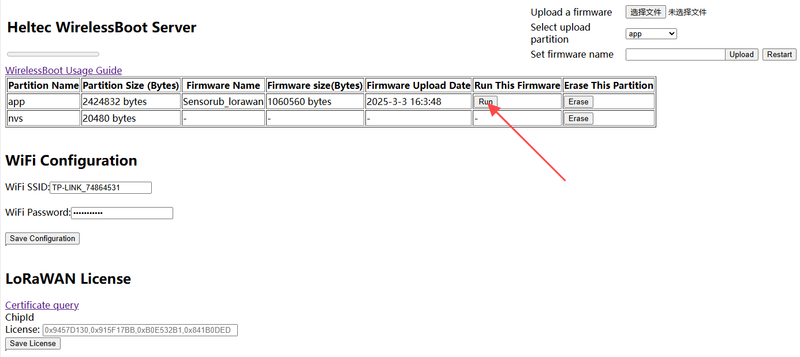
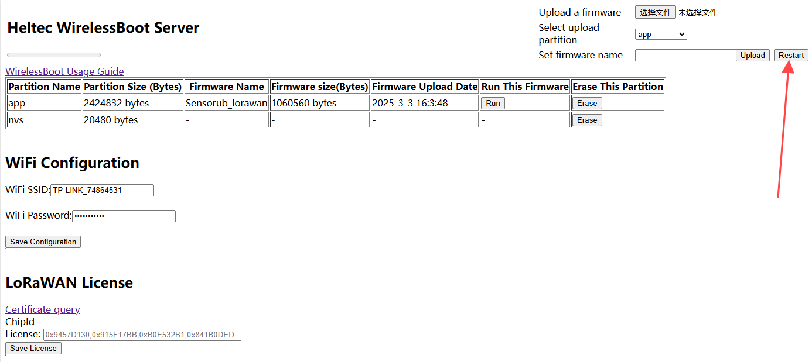

## Hardware Resources

- **Pin Layout**

​	The below picture only shows the common pins. For other pins, please refer to the schematic.

  

## Development Environment

### Third-party framework
This device is based on the ESP32-S3 and SX1262, you can use any development environment that supports these chips for development.
Compile the created firmware into a '.bin' file.
To upload the firmware, please proceed directly to Upload Firmware.

### WirelessBoot framework
Meanwhile, Heltec offers a branch based on the Heltec ESP32 development framework: the WirelessBoot Development Framework. Using this branch, you can program and debug the device with Arduino. For instructions and an introduction to using this framework, you can refer to this link:
/docs/devices/open-source-devices/esp32-series/wireless_boot?wb=wb

## Firmware Upload
We strongly recommend using the WirelessBoot mode to upload firmware.
### What is the WirelessBoot
WirelessBoot is a feature of the ESP32 that allows firmware updates to be performed wirelessly without the need for a USB or serial connection.
### How to Enter WirelessBoot
1. Press and hold the device button until the blue light stays on. Continue holding without releasing until the purple light turns on. At this point, release the button, and the device will enter WirelessBoot mode.

   

2. Locate the WiFi network named "WirelessBoot-xxxx" and connect to it. Default password is “heltec.org".

   

3. In your browser, enter "192.168.4.1" and use the default password "heltec.org". This is the interface for uploading firmware via WirelessBoot.

   

:::tip
You can configure the WiFi address on this page. After "Save Configuration", you can access the WirelessBoot mode through the device's IP address without needing to connect to its WiFi.
:::

### Upload Firmware

:::note
WirelessBoot only accepts firmware in “.bin” format.
:::

1. Navigate to the WirelessBoot page, choose the corresponding firmware,select an APP partition, and click "Upload."

   

:::note
The firmware name should not be too long; otherwise, it cannot be uploaded.
:::

2. After the upload is successful, click "RUN" to confirm which program you want to execute.

   

3. Click "Restart" to reboot the device and start its operation.

   

