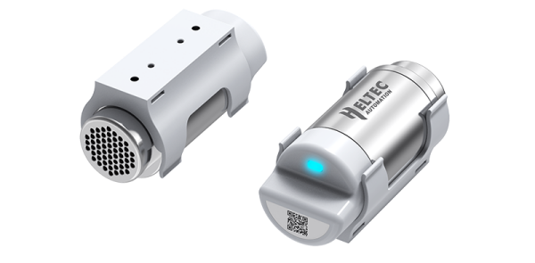

import Tabs from '@theme/Tabs';
import TabItem from '@theme/TabItem';
import styles from '@site/src/css/styles.module.css';
import DocCard from '@theme/DocCard';

  

Sensor Hub is a ready-to-use LoRa/LoRaWAN sensor for indoor (industrial) applications. Modular design allows for the replacement of sensor probes to adjust different projects. The device can be registered by one click via APP and Heltec Snap Emu IoT Platform.

{

  <a href="https://heltec.org/project/sensor-hub/" className={styles.btnLink1}>
    Product Page
  </a>

}

## Product characteristics

- One key register via APP and Heltec Snap Emu IoT Platform
- Ultra-low power with built-in 1100mAh rechargeable battery & magnetic charging
- LoRa / LoRaWAN compatible, supports OTA firmware upgrade
- Easy setup via Wi-Fi configuration page for platform integration
- Flexible installation: wall, cylinder, or track mounting

## Important parameters
| [parameters](https://resource.heltec.cn/download/Sensor%20Hub%20for%20industry/HRI-3621/HRI-3621.pdf)         | HRI-3621        |
|--------------------|----------------------------|
|Product Main Model    |	    	HRI-3621         |
|LoRa chipset |    SX1262              |
| Battery Capacity    |   		1100mAh              |
| Battery Type      | 	18350 rechargeable Li-On battery       |
| Max. TX Power      | 20±2 dBm  |

## Important Resources
- [Datasheet](https://resource.heltec.cn/download/Sensor%20Hub%20for%20industry/HRI-3621/HRI-3621.pdf)
- [Related links](https://resource.heltec.cn/download/Sensor%20Hub%20for%20industry)
- [Schematic](https://resource.heltec.cn/download/Sensor%20Hub%20for%20industry/Hardware_open-source_documentation)
- Publish MQTT Message
- Subscribe MQTT Messages from LoRa Server
- Data Format Document