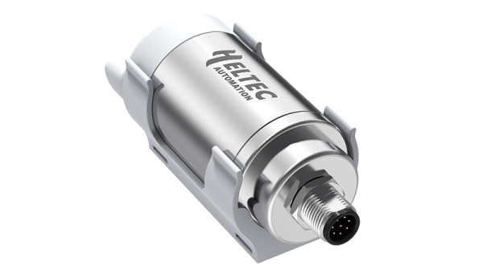

import Tabs from '@theme/Tabs';
import TabItem from '@theme/TabItem';
import styles from '@site/src/css/styles.module.css';
import DocCard from '@theme/DocCard';

  

HRI-3622, a sub-model of the Sensor Hub for Industry series, is designed to drive third-party sensors. Featuring low power consumption, long transmission range, and a built-in 1100mAh battery, it offers IP66 protection with a stainless-steel and high-strength plastic shell for reliable performance in harsh industrial environments.

{

  <a href="https://heltec.org/project/sensor-hub-hri-3622/" className={styles.btnLink1}>
    Product Page
  </a>

}

## Product characteristics

- Industrial grade protection structure, IP66 protection grade
- Ultra-low power consumption design, built-in 1100mAh 18350 rechargeable battery
- Support OTA, easy configure with in Web via WiFi
- Wireless data transmission communication radius up to 3km (no-occlusion)
- Compatible with wall fixing or cylinder fixing

## Important parameters
| [parameters](https://resource.heltec.cn/download/Sensor%20Hub%20for%20industry/HRI-3622/HRI-3622.pdf)         | HRI-3622        |
|--------------------|----------------------------|
|Product Main Model    |	    	HRI-3621         |
|LoRa chipset |    SX1262              |
| Battery Capacity    |   		1100mAh              |
| Battery Type      | 	18350 rechargeable Li-On battery       |
| Max. TX Power      | 20±2 dBm  |

## Important Resources
- [Datasheet](https://resource.heltec.cn/download/Sensor%20Hub%20for%20industry/HRI-3622/HRI-3622.pdf)
- [Related links](https://resource.heltec.cn/download/Sensor%20Hub%20for%20industry)
- [Schematic](https://resource.heltec.cn/download/Sensor%20Hub%20for%20industry/Hardware_open-source_documentation)
- Publish MQTT Message
- Subscribe MQTT Messages from LoRa Server
- Data Format Document