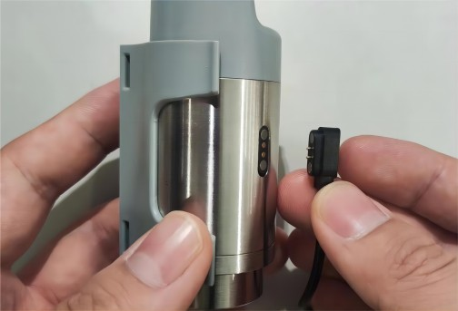
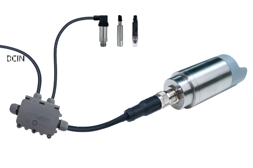
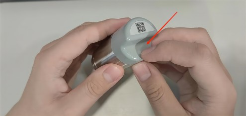
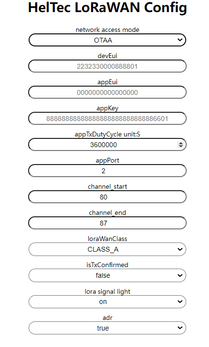

HRU-3622 is a sub-model of the Sensor Hub for outdoor series that specifically drives third-party sensors. Its interface is a flange seat, with 2 RS485 interfaces and 4 GPIO interfacesIt can be used to drive a variety of third-party sensors.
Sensor Hub for Industry has excellent low power consumption and long transmission distance characteristics, comes with a built-in 1100mAh rechargeable battery. The stainless-steel shell and high-strength plastic provide an IP66 protection level, allowing it to perform stably and excellently in complex industrial environments.

## Power supply
HRI-3622 integrates a 1100aMh rechargeable lithium battery, charging voltage is 5V and its charging interface is magnetic-2P, a single filling time is about 3~4 hours.

   

## LED light status description
The HRI-362x series has a wealth of indicator effects, which can help you more easily use the device, or determine the status of the device.

  

## Connect third-party sensors

There are two recommended ways to connect sensors:

### Connect the sensor directly to the HRI-3622.

 + We provide 12mm 8Pin flange conversion head, first through the flange seat diagram below, you can connect the pin of the sensor to the conversion head.

 
 
 + Connect the conversion head to the flange seat of the sensor hub and gently screw it on.

   

### Connect via Junction box
 + Connect the sensor junction box.

 + Connect the Junction box with the conversion head.

 + Connect the conversion head to the flange seat of the sensor hub and gently screw it on.

  

## Configura
### Enter Configuration mode
+ Long press the button on the top of the device, and the device will first display white light and then orange light. At this time, release your finger.

:::tip
If long press does not respond, try to connect the charging cable to wake up the battery management system. If the blue light/green light blinks sequentially after long press, it means that the device is in working state. After 5 seconds, when the light is all out and no longer blinks, release your finger and long press again to enter the configuration page. 
:::

   

+ Find the WiFi named **Sensor_Hub_xxxx** with your PC or mobile phone, connect it.

   

+ In the browser, type **192.168.4.1**, enter the configuration page.

   

### Parameter Definition
Configure the parameters according to specific requirements on the configuration page, and click `Submit` after the configuration is completed.The following is the definition of each parameter.

+ **LoRaWAN Configuration Page**: Shows the parameter configuration associated with LoRaWAN.

  

  - `Network access mode` LoRaWAN network access mode.
  - `NwkSKey` `appSKey` `devAddr` ABP node parameters, must be consistent across the server.
  - `RxWindow1Delay unit:S` Receive window 1 delay.
  - `RxWindow2Delay unit:S` Receive window 2 delay.
  - `Rx2dr` Window 2 data rate adaptive.
  - `DevEui`  `appEui`  `appKey` OTAA node parameters, must be consistent across the server.
  - `AppTxDutyCycle unit:S` Node transmission period.
  - `AppPort` appPort.
  - `Channel_start` LoRaWAN channel start.
  - `Channel_end` LoRaWAN channel end.
  - `LoRaWanClass`LoRaWAN Class A, Class C.
  - `IsTxConfirmed` Send Receive confirmation.
  - `LoRa signal light` Signal LED light switch.
  - `Adr` Data rate adaptation.
+ **Submit**: Configuration is complete, click here to submit.
+ **RS485 Configuration Page**: This page allows you to set RS-485 polling command.

  

  - `Add Command` Set a polling command, multiple clicks can set multiple, you can set the polling time in the red box position.
  - `Remove` Remove the command.
  - `Baud rate` Baud rate, rate of data signalling.
  - `Data bits` Data bits.
  - `Stop bits` Data stop bits.
  - `Parity` Parity check.
  - `Submit` Click Submit after the configuration is complete.
  
**OTA UPDATE**: Sensor Hub for Industry series supports OTA upgrade.

## Operating
### Power off
After the configuration is completed, long press the button for five seconds, and when the light goes off, the device is shut down.
### Power on
Press the button for 3 seconds. When the button shows white light, release the button. At this time, the device enters the working state, where the sending is green light and the receiving is purple light.

## Common problems and solutions
+ Unable to confirm device working status.
  Press the device button once, and if it shows blue light, it will wake up, and the device will upload a message immediately.

+ Device not working:
  After each configuration, you must button off in, then button on.