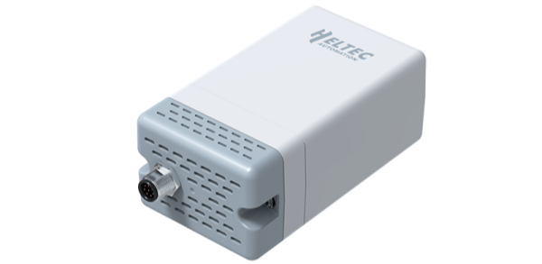

import Tabs from '@theme/Tabs';
import TabItem from '@theme/TabItem';
import styles from '@site/src/css/styles.module.css';
import DocCard from '@theme/DocCard';

  

Wireless Aggregator — Sensor Docker (HRI-3631) is a LoRa/LoRaWAN outdoor device with a standard interface for Heltec Fast Link sensors. It integrates 4×2000 mAh batteries with solar charging support and features ultra-low power consumption, long-range transmission, and durable housing for reliable long-term outdoor use.

{

  <a href="https://heltec.org/project/hri-3631/" className={styles.btnLink1}>
    Product Page
  </a>

}

## Product characteristics

- Industrial-grade IP66 protection with lightning, ESD, and isolation
- Ultra-low power with 4×1900 mAh rechargeable batteries, supports solar charging
- Wireless data transmission communication radius up to 1.5~5km (noocclusion)
- Working condition: -40~80°C,Working humidity: ≤90% (non-condensing)
- Easy configure via Wi-Fi, supports OTA update

## Important parameters
| [parameters](https://resource.heltec.cn/download/Wireless_Aggregator/HRI-3631.pdf)         | HRI-3631        |
|--------------------|----------------------------|
|Max. Receiving Sensitivity   |	    	-136dBm@SF12 BW=125KHzv         |
|Communication Distance |    2 to 6km             |
| Battery Capacity    |   		2000mAh x4              |
| Battery Type      | 	18650      |
| Max. TX Power      | 20±2 dBm  |

## Important Resources
- [Datasheet](https://resource.heltec.cn/download/Wireless_Aggregator/HRI-3631.pdf)
- [Related links](https://resource.heltec.cn/download/Wireless_Aggregator)
- [Wireless Aggregator Series Introduction](https://heltec.org/wireless-aggregator/)
- Publish MQTT Message
- Subscribe MQTT Messages from LoRa Server
- Data Format Documents