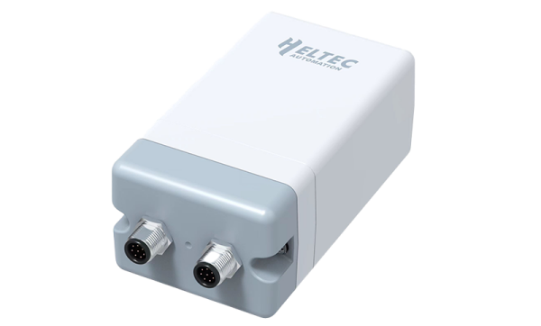

import Tabs from '@theme/Tabs';
import TabItem from '@theme/TabItem';
import styles from '@site/src/css/styles.module.css';
import DocCard from '@theme/DocCard';

  

HRI-3633 is a LoRaWAN converter in the Sensor Hub for Outdoor series, designed to drive and control two solenoid valves while reading two electrical pulses. With IP66 protection, low power consumption, long-range transmission, and a rechargeable battery supporting DC and solar charging, it ensures reliable long-term outdoor operation.

{

  <a href="https://heltec.org/project/hri-3633/" className={styles.btnLink1}>
    Product Page
  </a>

}

## Product characteristics

- Industrial-grade IP66 protection with lightning, ESD, and isolation
- Ultra-low power consumption design
- Wireless data transmission communication radius up to 5km(no occlusion)
- Working condition: -40~80°C,Working humidity: ≤90% (non-condensing)
- Easy configure via Wi-Fi, supports OTA update

## Important parameters
| [parameters](https://resource.heltec.cn/download/Wireless_Aggregator/HRI-3632%40.pdf)         | HRI-3632        |
|--------------------|----------------------------|
|Max. Receiving Sensitivity   |	    	-136dBm@SF12 BW=125KHzv         |
|Signal Range |    5km            |
| Battery Capacity    |   		2000mAh x4              |
| IP Rating      | 	IP66     |
| Max. TX Power      | 21±1 dBm  |

## Important Resources
- [Datasheet](https://resource.heltec.cn/download/Wireless_Aggregator/HRI-3633%40.pdf)
- [Related links](https://resource.heltec.cn/download/Wireless_Aggregator)
- [Wireless Aggregator Series Introduction](https://heltec.org/wireless-aggregator/)
- Publish MQTT Message
- Subscribe MQTT Messages from LoRa Server
- Data Format Documents

## Product Guide
- [Connect to LoRaWAN Server](/docs/devices/open-source-devices/plug-play/hri-3631-wireless-aggregator-sensor-docker/connect_to_lora_server)
- [OTA Upgrade](/docs/devices/open-source-devices/plug-play/hri-3631-wireless-aggregator-sensor-docker/ota_upgrade)