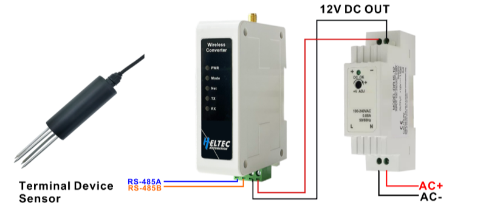

import Tabs from '@theme/Tabs';
import TabItem from '@theme/TabItem';
import styles from '@site/src/css/styles.module.css';
import DocCard from '@theme/DocCard';

  

The HRI-4851L enable RS-485 data to be transmitted via LoRaWAN. This highly dependable DTU device is suitable for deployment in industrial settings and can be mounted directly on rack rails, thus enabling IoT evolution for previous devices. Additionally, the series features an effortless configuration function that allows for the direct management and configuration of options and parameters within the Local Area Network (LAN).

{

  <a href="https://heltec.org/project/rs485-lorawan-wireless-converter/" className={styles.btnLink1}>
    Product Page
  </a>

}

## Product characteristics

- DC 4.5~28V wide voltage input
- Rack rails compatible
- Built-in configuration page allows device setup and maintenance via LAN without extra software
- Default LoRaWAN protocol, can be converted to a peer-to-peer LoRa protocol via OTA
- Support polling command

## Important parameters
| [parameters](https://resource.heltec.cn/download/HRI-485X/HRI-485x.pdf)         | HRI-4851-LoRaWAN        |
|--------------------|----------------------------|
|MCU     |	    ESP32C3-FN4            |
|LoRa chipset |    SX1262              |
| Max. TX Power      |   	21±1dBm                 |
| Rack rail width        | 	35 mm          |
| Operating temperature     | -40 ~ 85℃   |

## Important Resources
- [Datasheet](https://resource.heltec.cn/download/HRI-485X/HRI-485x.pdf)
- [Related links](https://resource.heltec.cn/download/HRI-485X)

