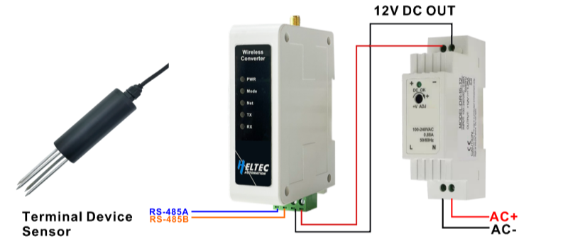

import Tabs from '@theme/Tabs';
import TabItem from '@theme/TabItem';
import styles from '@site/src/css/styles.module.css';
import DocCard from '@theme/DocCard';

  

The HRI-485x series is a Data Transfer Unit (DTU) designed to enable wireless data transmission by converting the RS-485 bus. Specifically, the HRI-4851 model supports transmitting RS-485 data over LoRa, providing a reliable long-range communication solution.

{

  <a href="https://heltec.org/project/rs485-lora-wireless-converter/" className={styles.btnLink1}>
    Product Page
  </a>

}

## Product characteristics

- DC 4.5~28V wide voltage input
- Rack rails compatible
- Built-in configuration page allows device setup and maintenance via LAN without extra software
- HRI-4851: can be configured as point to point, point to many, or mesh mode
- Support for data encryption,1024 bytes cache, a single packet supports up to 240 bytes.

## Important parameters
| [parameters](https://resource.heltec.cn/download/HRI-485X/HRI-485x.pdf)         | HRI-4851        |
|--------------------|----------------------------|
|MCU     |	    ESP32C3-FN4(HRI-4851)            |
|LoRa chipset |    SX1262              |
| Max. TX Power      |   	21±1dBm                 |
| Rack rail width        | 	35 mm          |
| Buffer       | 1024 bytes   |

## Important Resources
- [Datasheet](https://resource.heltec.cn/download/HRI-485X/HRI-485x.pdf)
- [Related links](https://resource.heltec.cn/download/HRI-485X)

