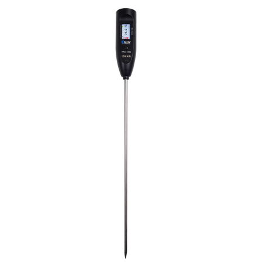

import Tabs from '@theme/Tabs';
import TabItem from '@theme/TabItem';
import styles from '@site/src/css/styles.module.css';
import DocCard from '@theme/DocCard';

  

Wireless Aggregator — Sensor Docker (HRI-3631) is a LoRa/LoRaWAN outdoor device with a standard interface for Heltec Fast Link sensors. It integrates 4×2000 mAh batteries with solar charging support and features ultra-low power consumption, long-range transmission, and durable housing for reliable long-term outdoor use.

{

  <a href="https://heltec.org/project/wireless-thermoprobe/" className={styles.btnLink1}>
    Product Page
  </a>

}

## Product characteristics

- Temperature range -40~200℃, optimal accuracy ±1℃
- Support LoRaWAN, configure via BLE
- Recommended Working humidity: ≤90% (non-condensing)
- Wireless data transmission communication radius up to 1.5~3km (noocclusion)
- Built-in 800mAh rechargeable lithium battery, charging voltage 5V DC, long endurance

## Important parameters
| [parameters](https://resource.heltec.cn/download/HRU-1000/HRU-1000.pdf)         | Wireless Thermoprobe       |
|--------------------|----------------------------|
|Max. Receiving Sensitivity   |	    	-136dBm@SF12 BW=125KHzv         |
|Display |   	0.96inch LCD          |
|Signal Range    |   		3km             |
| Battery Capacity      | 	800mAh     |
| Max. TX Power      | 20±2 dBm  |

## Important Resources
- [Datasheet](https://resource.heltec.cn/download/HRU-1000/HRU-1000.pdf)  
- [Related links](https://resource.heltec.cn/download/HRU-1000)
- Publish MQTT Message
- Subscribe MQTT Messages from LoRa Server
- Data Format Documents

