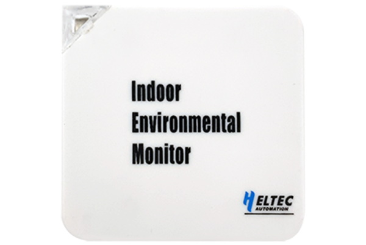

import Tabs from '@theme/Tabs';
import TabItem from '@theme/TabItem';
import styles from '@site/src/css/styles.module.css';
import DocCard from '@theme/DocCard';

  

The HRU-3601A is a cost-effective indoor LoRa temperature and humidity monitor that uploads data to the cloud via LoRaWAN. It offers wide transmission range, low power consumption, high precision, and easy installation, making it ideal for homes and industrial environments.

{

  <a href="https://heltec.org/project/hru-3601/" className={styles.btnLink1}>
    Product Page
  </a>

}

## Product characteristics

- ESP32-C3FN4 + SX1262, supporting Wi-Fi and LoRa/LoRaWAN
- Power supply: USB Type-C 5V, compact and refined design
- High performance: high sensitivity, precision, and low power consumption
- Monitoring: remote data access via server; supports temperature & humidity (3601A)
- Features: OTA upgrade, reliable operation from -20°C to 50°C

## Important parameters
| [parameters](https://resource.heltec.cn/download/HRU3601/HRU-3601.pdf)         | HRU-3601        |
|--------------------|----------------------------|
|MCU     |	    ESP32C3-FN4          |
|LoRa chipset |    SX1262              |
| Push Interval     |   	2 Minutes(min)                |
| Supply Voltage       | 	USB-TypeC 5V       |
| Sensor Module       | GXHTV3   |

## Important Resources
- [Datasheet](https://resource.heltec.cn/download/HRU3601/HRU-3601.pdf)
- [Related links](https://resource.heltec.cn/download/HRU3601)
- Publish MQTT Message
- Subscribe MQTT Messages from LoRa Server
