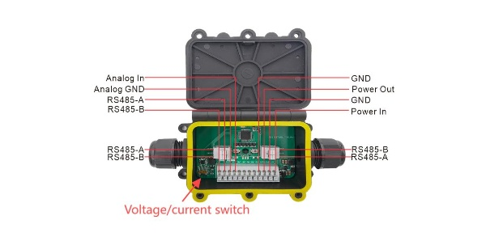

import styles from '@site/src/css/styles.module.css';

  

The junction box collects 4–20 mA sensor signals and converts them to RS485 for transmission to the Sensor Hub, ensuring accurate and reliable data delivery for further processing.

{

  <a href="https://heltec.org/project/junction-box/" className={styles.btnLink1}>
    Product Page
  </a>

}

## Product characteristics

- Easy install: Quick setup
- Multi-interface: 4–20mA / RS485
- Compatible: Works with many sensors
- Reliable: Stable data transmission
- Rugged: IP68, fits Sensor Hub

## Important parameters
| parameters        | Junction Box        |
|--------------------|----------------------------|
|Source Voltage   |	    	4.5~50V(Subject to sensor)     |
|Temperature |   	-40~85℃             |
| Humidity    |   	99% (Non condensing)              |
| Supported Wire Diameter     | 		5~9mm(A/B); 3.5~7mm(C/D)      |

