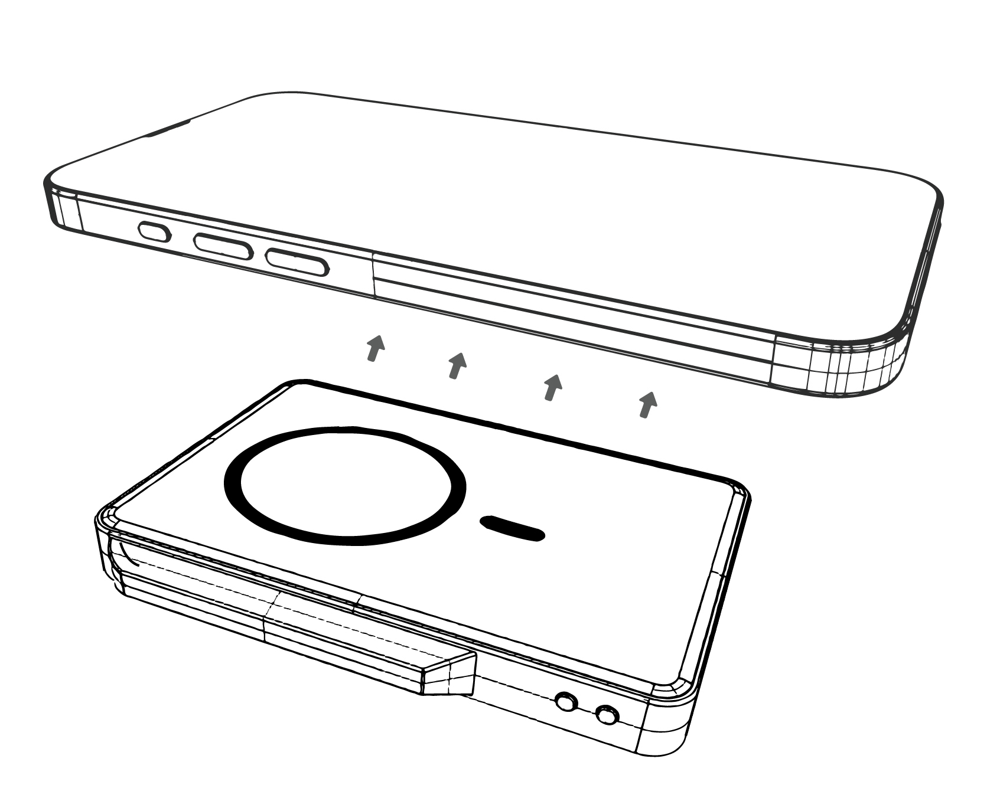
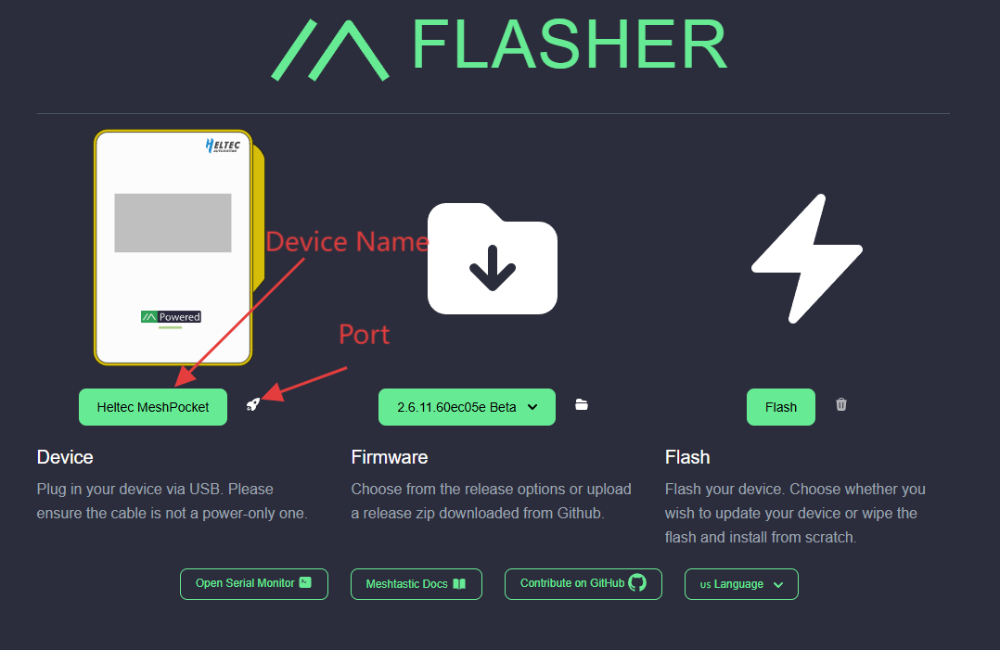
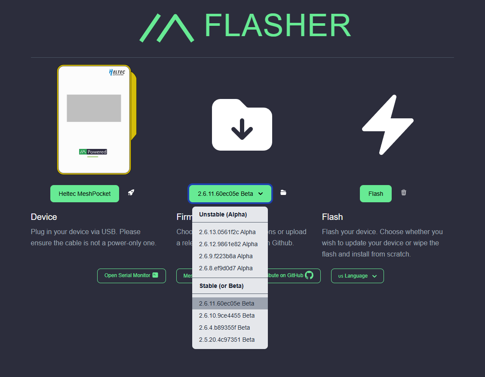
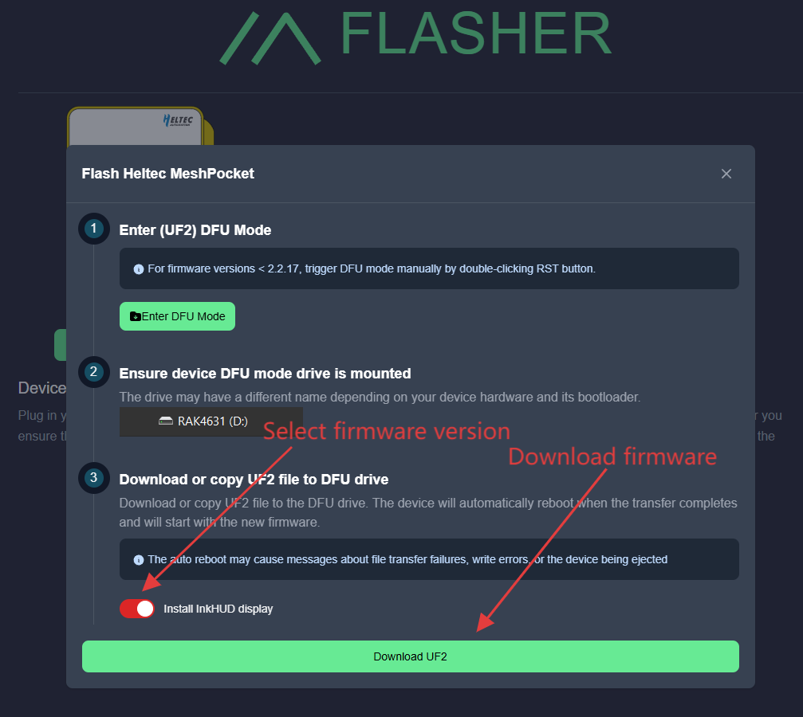
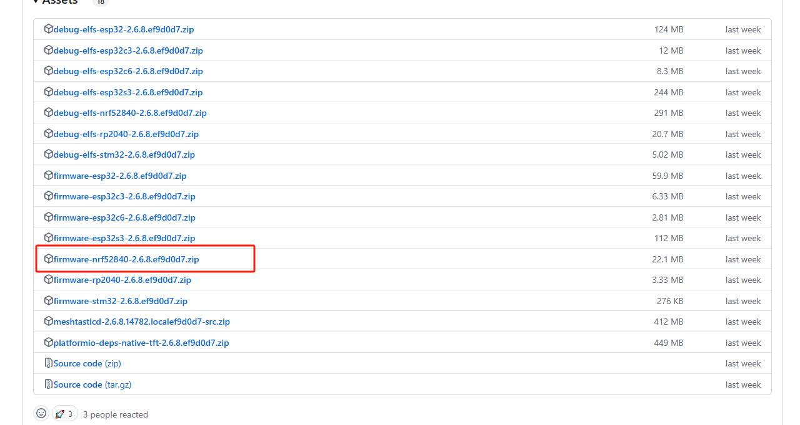
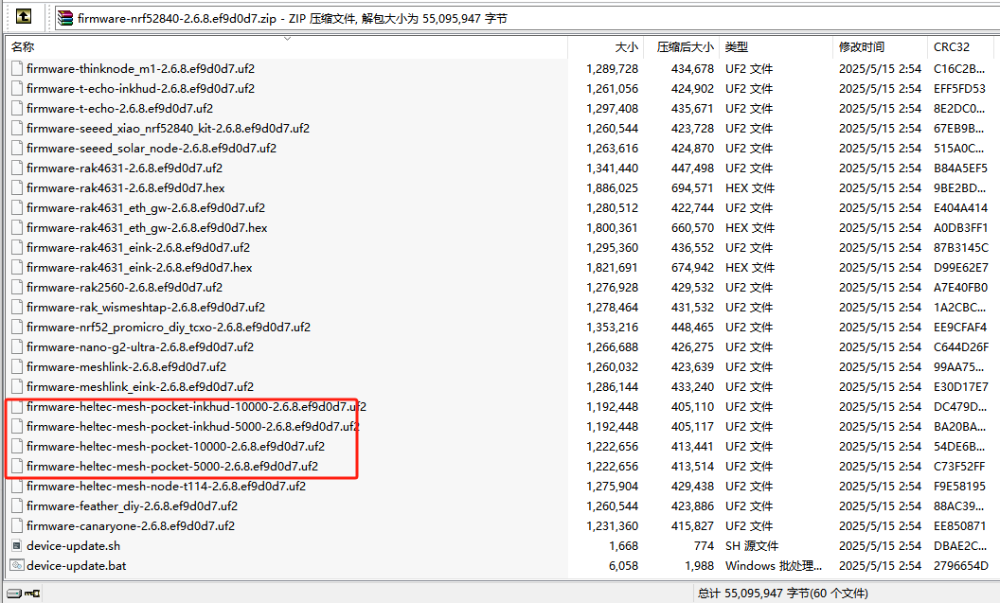

## Charging

:::note
For first-time use, fully discharge the power bank, then recharge the device to 100%.
:::

## Magnetic wireless charging output

This product supports the automatic induction charging function of magnetic mobile phones. You only need to place the magnetic mobile phone on the magnetic wireless charging area of the mobile power supply to charge normally. Click “CTRL” button to turn on wireless output. Double click **“CTRL”** button to turns off wireless output.

  

:::note
The wireless charger supports MPP, EPP, Samsung 10W, Apple 7.5W, and BPP protocols. Please ensure your phone supports the wireless fast charging protocol.
:::

### USB-C power delivery output

Use the USB-C data cable to connect the device to be charged and the magnetic power bank to charge the device to be charged. Long press “CTRL” to turns off wireless output and wired output.

  

   
### USB-C charging input(for power bank)

Connect one end of the USB-C data cable to the USB-C interface of the mobile power supply, and then connect the other end to the charger to charge the mobile power supply. During charging, the corresponding power indicator light flashes and the remaining power is displayed.

  

### Battery Level Indicator

| Remaining battery | Indicator                       |
|-------------------|---------------------------------|
| 71%–100%          | Green light on steadily         |
| 31%–70%           | Yellow light on steadily        |
| 11%–30%           | Red light on steadily           |
| 5%–10%            | Red light flashing slowly 0.5Hz |

:::note
≤5% remaining, it extinguishes and the wired/wireless charging output is turned off, but power can still be supplied to the wireless communication section.
:::

## RGB Indicator Description

| Status                   | Battery Level | Indicator                                       |
|---------------------------|---------------|-------------------------------------------------|
| Over-discharge / no power | ≤5%           | Red light flashes rapidly at 2Hz, extinguishes after 5s |
| Over-discharge / no power | 1–30%         | Red light flashing slowly at 0.5Hz              |
| Over-discharge / no power | 31–70%        | Yellow light flashing slowly at 0.5Hz           |
| Over-discharge / no power | 71–100%       | Green light flashing slowly at 0.5Hz            |
| Fully charged             | –             | Green light on steadily                         |
| Standby (button triggered)| –             | Current battery level color flashes             |
| Foreign Object Detection (FOD) | –        | Yellow light flashes rapidly at 2Hz             |
| Fault                     | –             | Indicator light extinguishes, output shuts down |

---

## Button Description

:::warning
The **USER/RST** function depends on the Meshtastic firmware version.  
For details, see the official documentation: [meshtastic.org](https://meshtastic.org).
:::

| Button | Status        | Description                                        |
|--------|---------------|----------------------------------------------------|
| CTRL   | Single click  | Turns on output; shows battery level via LED       |
| CTRL   | Double click  | Turns off wireless output                          |
| CTRL   | Long press    | Turns off wireless + wired output                  |
| USER   | Single click  | Toggle Meshtastic options                          |
|        | Long press    | Select Meshtastic option / Turn off Meshtastic     |
| RST    | Single click  | Reset / wake-up Meshtastic                         |

## Serial Port & Firmware Flashing

The device comes preloaded with Meshtastic firmware. Firmware updates/flashing can be performed via the side-mounted magnetic programming interface.

  

## Meshtastic (Default Firmware)

### What is Meshtastic

The MeshPocket comes preloaded with Meshtastic firmware.  
See official docs: [Introduction and Beginner's Guide to Meshtastic](https://meshtastic.org/docs/introduction/)

### Web Flasher

1. Open the [Meshtastic Web Flasher](https://flasher.meshtastic.org/).  
2. Locate the corresponding device and port.  

  

  
3. Select the firmware version (recommended: latest *Stable*).  

  

 
4. Click **Flash** → then **Download UF2**.  

  

5. Double-press the **RST** button to enter DFU mode.  
   A removable drive (**HT-n5262**) will appear.  
6. Copy the UF2 file into the drive.  
   If an error prompt appears, select **Skip**.  

---

### Manual Flasher

1. Obtain the firmware.  

  

  

  

 

2. Connect the device to your PC using the magnetic USB cable.  
3. Double-click the **USER** button → enter DFU mode.  
   A drive named **HT-n5262** will appear.  
4. Copy the firmware to this drive.  
5. Installation completes automatically after transfer.  

## Device Firmware Customization

Firmware updates/flashing can be performed via the side-mounted magnetic programming interface.  
