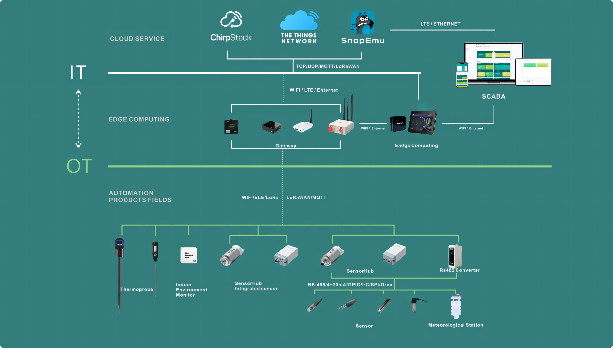

import Tabs from '@theme/Tabs';
import TabItem from '@theme/TabItem';




This document provides an overview of LoRaWAN Application deployment, focusing on the integration of LoRaWAN gateways and plug-and-play sensor nodes. It is designed to help developers and users quickly understand how to set up, configure, and operate LoRaWAN devices in real-world scenarios.

## Usage Guide

This Usage Guide provides detailed operating instructions for LoRaWAN Appliaction, including LoRa Gateway and LoRa Node Devices, to help users correctly set up, configure, and deploy them in practical IoT scenarios.


```mdx-code-block
import DocCardList from '@theme/DocCardList';

<DocCardList />
```


