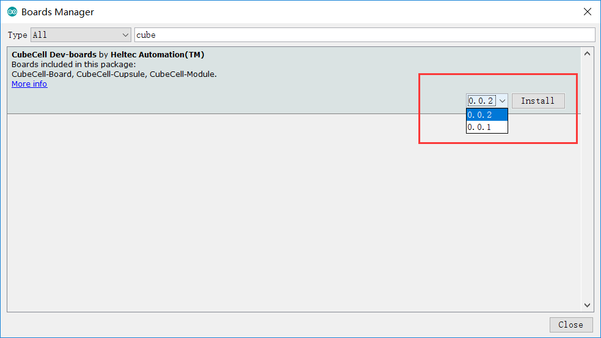
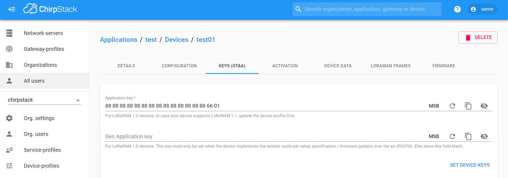

import Tabs from '@theme/Tabs';
import TabItem from '@theme/TabItem';
import styles from '@site/src/css/styles.module.css';
import DocCard from '@theme/DocCard';

<Tabs
groupId="cubecell"
queryString="cubecell"
defaultValue="cubecell"
className={styles.customTabs}
values={[
{label: 'CubeCell Series Quick Start', value:'cubecell'},
{label: 'LoRaWAN', value:'lorawan'},
]}>

<TabItem value="cubecell">


## There are two methods to install the development framework, choose one of they:

<Tabs>
  <TabItem value="1" label="Arduino Board Manager" default>

This topic describes the steps to install the Cubecell development framework through the Board Manager that comes with Arduino.

1. Open Arduino IDE, and click `File`->`Peferences`->`Settings`

<div style={{ textAlign: 'center' }}>
  
</div>

<div style={{ textAlign: 'center' }}>
  
</div>


2. Input following json url to board manager URLs:

 https://github.com/HelTecAutomation/CubeCell-Arduino/releases/download/V1.5.0/package_CubeCell_index.json


<div style={{ textAlign: 'center' }}>
  
</div>


3. Click **Tools** -> **Board** -> **Boards Manager**...`, search **Heltec cubecell** in the new pop-up dialog, select the latest releases and  click **INSTALL**.


<div style={{ textAlign: 'center' }}>
  
</div>

Other installation methods can be found here: `CubeCell Framework Installation`.


  </TabItem>
  <TabItem value="2" label="Local File">

This chapter describes how to install the CubeCell development framework by downloading an installer.

1. Download the development framework: https://resource.heltec.cn/download/CubeCell/CubeCell.zip

2. Open Arduino IDE, and click **File**-> **Peferences**.

<div style={{ textAlign: 'center' }}>
  
</div>


3. See the library installation path.

<div style={{ textAlign: 'center' }}>
  
</div>

4. Open the path. Create a new **hardware** folder in the Arduino folder. **If there is already a "hardware" folder, you don't need to create a new one.**

<div style={{ textAlign: 'center' }}>
  
</div>


5. Unzip the downloaded installation package into hardware.

<div style={{ textAlign: 'center' }}>
  
</div>


6. This is the final correct path, please refer to.

<div style={{ textAlign: 'center' }}>
  
</div>


7. Restart the Arduino IDE to confirm whether the development environment is installed successfully.

<div style={{ textAlign: 'center' }}>
  
</div>


</TabItem>
</Tabs>


  
</TabItem>
<TabItem value="lorawan" >


<Tabs>
  <TabItem value="configuration_parameter" label="LoRaWAN Configuration Parameter" default>

## Config LoRaWAN Networking Parameters for CubeCell (Dev EUI, App Key, etc.)

## Summary

No matter what LoRa management platform is used, DevEui, AppKey, etc. parameters are must needed. And ensure that it is consistent with the relevant settings on the server.

- **The following parameters are essential for OTAA mode:**
  - DevEui-- Mote device IEEE EUI (big endian), 8 bytes;
  - AppEui -- Application IEEE EUI (big endian), 8 bytes;
  - AppKey -- AES encryption/decryption cipher application key, 16 bytes;
- **The following parameters are essential for ABP mode:**
  - NwkSKey-- AES encryption/decryption cipher network session key, 16 bytes;
  - AppSKey -- AES encryption/decryption cipher application session key, 16 bytes;
  - devaddr-- Device address on the network (big endian), uint32_t;

:::tip
There are three methods to configuration LoRaWAN networking parameters, choose one of them.
:::


:::tip
Parameters such as frequency band need to be modified in "Tools".
:::


## Via Modify Code

The relevant parameters of the LoRaWAN network are in the corresponding `.ino` file:


Change the code and Compile/Upload again.


:::note
The follows two methods need AT-Command enable.
:::

## Via AT Command

In order to use AT command, need enable AT command in the "Tools" menu before upload.


### Serial Port Settings

- Baud rate: 115200
- Stop bit: 1
- Data bits: 8
- DTR, RTS requirement: **None**
- Ending characters: **None**

:::note
Make sure there is NO ending characters or new line in you serial monitor config!
:::

With AT command support, the CubeCell is sleeping by default. Any content through the serial port will wake it up. It means the First command via serial port only wake up system.

For example, if send any contents such as `hello`, you will get this reply:

`ASR is Waked,LowPower Mode Stopped`


### DevEui

:::tip
We take all zero just for example
:::

Config DevEui to "0000000000000000", send following command via serial port:

`AT+DevEui=0000000000000000`

Command running success will print feedback: 

```
+OK
+DevEui=0000000000000000(For OTAA Mode)
```

### AppEui

Config AppEui to "0000000000000000", send following command via serial port:

`AT+AppEui=0000000000000000`

Command running success will print feedback: 

```
+OK
+AppEui=0000000000000000(For OTAA Mode)
```

### AppKey

Config AppKey to "00000000000000000000000000000000", send following command via serial port:

`AT+AppEui=00000000000000000000000000000000`

Command running success will print feedback: 

```
+OK
+AppEui=00000000000000000000000000000000(For OTAA Mode)
```

### NwkSKey

Config NwkSKey to "00000000000000000000000000000000", send following command via serial port:

`AT+NwkSKey=00000000000000000000000000000000`

Command running success will print feedback: 

```
+OK
+NwkSKey=00000000000000000000000000000000(For ABP Mode)
```

### AppSKey

Config AppSKey to "00000000000000000000000000000000", send following command via serial port:

`AT+AppSKey=00000000000000000000000000000000`

Command running success will print feedback: 

```
+OK
+AppSKey=00000000000000000000000000000000(For ABP Mode)
```

(devaddr)=
### DevAddr

Config DevAddr to "00000000", send following command via serial port:

`AT+DevAddr=00000000`

Command running success will print feedback: 

```
+OK
+DevAddr=00000000(For ABP Mode)
```

### Duty Cycle

LoRa Node's default sending data period is 15 seconds, change this period to 60 seconds:

`AT+DutyCycle=60000`

### Reset CubeCell

LoRaWAN parameters need reset to active, CubeCell can reset via three methods:

- Push the RST key;
- Use AT command: `AT+RESET=1`
- Provide a ≥10ms LOW signal to RST pin.

Looking for more AT commands? Please refer to **[CubeCell AT Command list](https://resource.heltec.cn/download/CubeCell/AT_Command_list/CubeCell_Series_AT_Command_User_Manual_V0.4.pdf)**.


## Via CubeCell Configurator

Special thanks [WASN](https://github.com/wasn-eu) made a configurator for CubeCell, now it's only have Windows<sup>®</sup> support.

[https://github.com/wasn-eu/CubeCell_Getting_Started](https://github.com/wasn-eu/CubeCell_Getting_Started)


</TabItem>
<TabItem value="connect-to-server" label="Connect to LoRaWAN server" default>

1. In this document, all operations and tests must be performed with a standard [LoRaWAN Gateway](https://heltec.org/proudct_center/lora/lora-gateway/), In the CubeCell's LoRaWAN library, for each working band, we are strictly follow [LoRaWAN™ 1.0.2 Regional Parameters rB](https://resource.heltec.cn/download/LoRaWANRegionalParametersv1.0.2_final_1944_1.pdf).

   ## Summary

   LoRaWAN protocol is the essence of all LoRa applications. In our opinion, the most prominent benefits of LoRaWAN are as follows:

   - Very friendly for low power applications. For example, your application need send data to server every 10 minutes, then in a cycle, only ~1 second is in the state of sending, other 9 minutes and 59 seconds are in low sleep low power Consuming status.
   - A star network can be formed via a [LoRa Gateway](https://heltec.org/proudct_center/lora/lora-gateway/), nodes and gateways from different manufacturers can communicate with each other through LoRaWAN protocols;
   - The protocol already includes processing mechanisms such as blocking, automatic frequency modulation, and encryption, which can better ensure the smooth flow of nodes and gateway；
   - ADR (Adaptive Data Rate).

   :::tip
   CubeCell LoRaWAN library is migration from LoRaMac-node version v4.3.2
   :::

   

   ## Preparation

   - Correct installed Arduino IDE and [CubeCell Framework](https://heltec-automation-docs.readthedocs.io/en/latest/cubecell/quick_start.html).
   - A standard LoRaWAN gateway with at least 8 channels (based on SX1301/8 base band chip will be OK), and make sure your gateway had already connected to a LoRa server.
     - [How to connect HT-M01 to a LoRa server]
     - [How to connect HT-M02 to a LoRa server]
     - [How to connect HT-M01S to a LoRa server]
   - A [CubeCell Dev-Board](https://heltec.org/project/htcc-ab01/) or [CubeCell-Cupsule](https://heltec.org/project/htcc-ac01/) and a high quality USB cable.

   **In this example, we use [HT-M01 Mini Gateway](https://heltec.org/project/ht-m01/) in Windows<sup>®</sup> 10. Test band: EU868, others working band is similar.**

   ### Running an example in Arduino

   In the "LoRa" path, all examples named with "LoRaWAN_xxx" format are the examples with LoRaWAN protocol, choose one of them.

   

   Don't forget [config the parameters in "Tools" menu](/docs/devices/open-source-devices/cubecell-series/cubecell-quick-start?cubecell=cubecell), here is my configration for EU868:

   

   :::note
   the tools menu must matching with the configration in LoRa server. For example, if CubeCell use OTAA, the LoRa server must enable OTAA for relevant device.
   :::

   ## Connect to TTN/TTS

   Before that, make sure there is a LoRa Gateway active in your [TTN](https://console.thethingsnetwork.org/)/[TTS](https://lora.heltec.org/console) account.

   ### Register a device

   Register a new device in TTN or TTS “Applications” page. Select the corresponding Brand, Model, Hardware Version, Firmware Version, Region.

   

   Select the frequency plan, and fill in the corresponding AppEUI, DevEUi, AppKey, and register the device.

   

   After registration is complete, if all is well, you will see the device active.

   

   ## Connect to ChirpStack

   Register a new device in ChirpStack’s “Applications” page. Enter the device name, description, DevEUI. Select Device-profile.

   

   Enter the Application key of the device.

   

   After registration is complete, if all is well, you will see the device active.

   

   ## Important Hints

   Please double check the following two things:

   1. The LoRaWAN parameters is the same as server!
   2. The listening frequency of your LoRa Gateway is the same as CubeCell's sending frequency. We strictly follow [LoRaWAN™ 1.0.2 Regional Parameters rB](https://resource.heltec.cn/download/LoRaWANRegionalParametersv1.0.2_final_1944_1.pdf);


</TabItem>
</Tabs>
    
    

  

</TabItem>
</Tabs>
