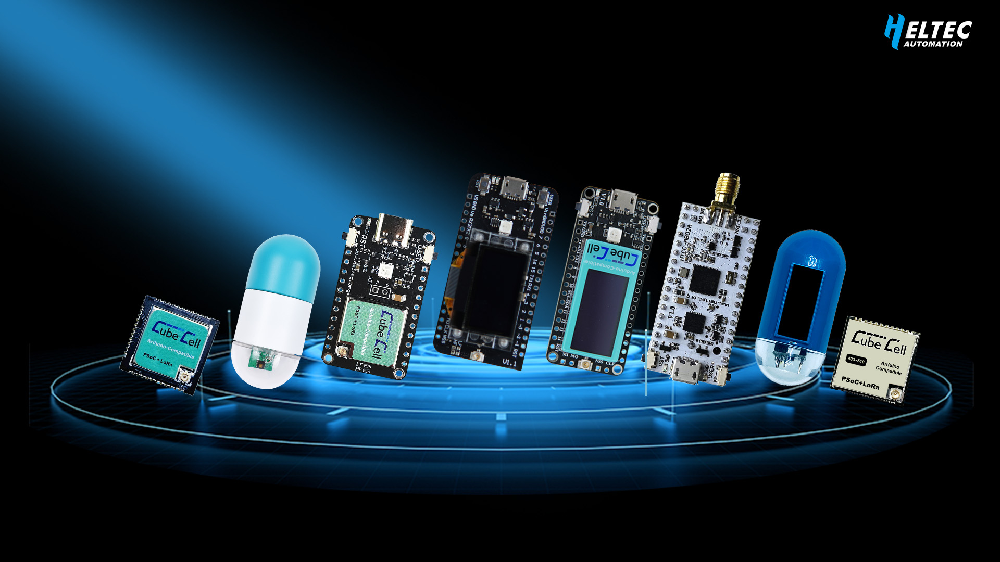

import Tabs from '@theme/Tabs';
import TabItem from '@theme/TabItem';
import styles from '@site/src/css/styles.module.css';
import DocCard from '@theme/DocCard';


<div style={{ textAlign: 'center' }}>
  
</div>

# Heltec Cubecell Series ASR-650x 

We believe the CubeCell(ASR-650X) Series ASR-650x is the best
choice for LoRaWAN node applications. The following are some of the key
features:

-  Fully compatible with the Arduino development environment.
-  Based on an ultra low power design, attains 3.5uA in deep sleep mode, even with the RTC clock running.
-  LoRa signal output put power range 0~22(±1) dBm.
-  Low-cost despite its current state of the art technology.
-  Integrated encryption algorithm protects your investment by rendering cloned firmware inoperative.
-  Based on proven technology - the new ASR650x, is a combination of the PSoC4000 and SX1262 into a single chip, reducing the overall size to something smaller than the competition.
-  It supports solar panel power supply, the LoRaWAN protocol, and AT commands.
-  In the LoRaWAN relevant examples, have a reasonable timeline planning.

:::tip
for example, an application need send data to server every 10 minutes, then in a cycle, only ~1 second is in the state of sending, other 9 minutes and 59 seconds are in deep sleep low power Consuming status.
:::


## Usage Guide

This Usage Guide provides detailed operating instructions for the cubecell series nodes, offering practical guidance and best practices to help users configure, manage, and deploy their devices more efficiently.


```mdx-code-block
import DocCardList from '@theme/DocCardList';

<DocCardList />
```


## Relevant Offical Resources

- [ASR650x - Arduino repository](https://github.com/HelTecAutomation/ASR650x-Arduino)
- [CubeCell introduction page ](https://heltec.org/lora-enablecubecell-series/)

