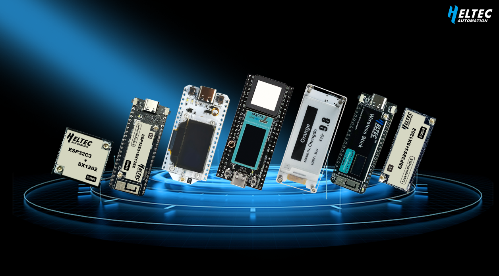

import Tabs from '@theme/Tabs';
import TabItem from '@theme/TabItem';


<div style={{ textAlign: 'center' }}>
  
</div>

# Heltec ESP32 Series

Heltec ESP32 Series is a range of development boards and modules built on the Espressif ESP32 chipset, widely used in IoT, wireless communication, sensing, and edge computing applications. Select models integrate features such as LoRa, OLED displays, and GNSS, offer full compatibility with the Arduino development environment, and support protocols like Meshtastic and LoRaWAN.


## Usage Guide

This Usage Guide provides detailed operating instructions for the ESP32 series nodes, offering practical guidance and best practices to help users configure, manage, and deploy their devices more efficiently.

```mdx-code-block
import DocCardList from '@theme/DocCardList';

<DocCardList />
```