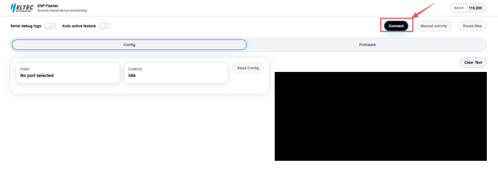
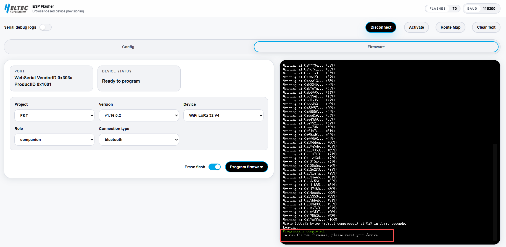
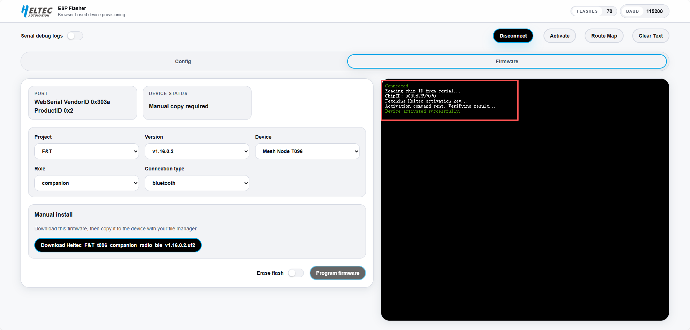
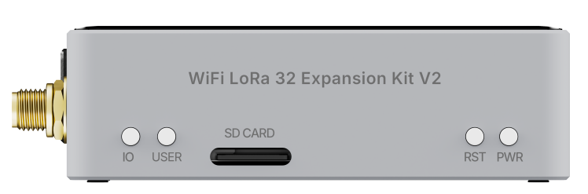
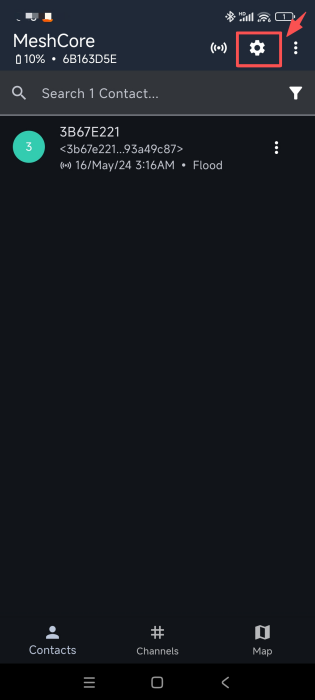
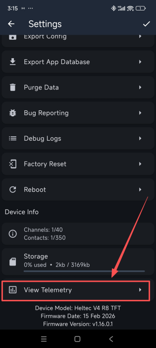
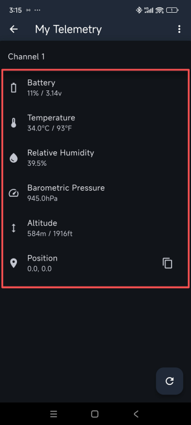
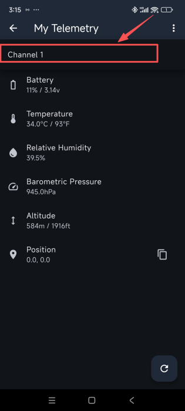
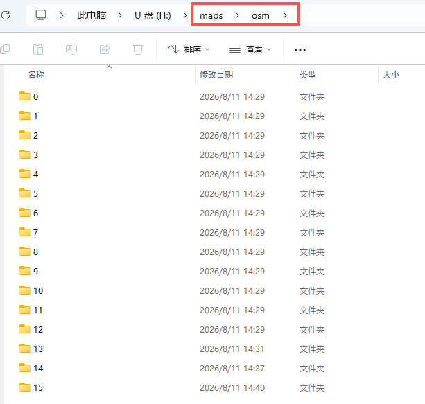

import styles from '@site/src/css/styles.module.css';


>Before using the F&T system, refer to [this document](/docs/devices/open-source-hardware/esp32-series/lora-32/wifi-lora-32-v4r8/quick-start) to complete the basic device configuration and setup.

## Flash F&T Firmware

***Follow the steps below to flash the F&T firmware:***

1. Connect the device to your computer using a USB cable.

2. **Enter Bootloader mode:**  Press and hold the **USER button**, then press and release the **RST button**, and finally release the **USER button**. The device will enter Bootloader mode and become ready for firmware flashing.

:::note
  After entering Boot mode, the serial port number may change, so remember to reselect the port.
:::


3. Open the firmware flashing page: https://devremote.heltec.org/

4. Click **Connect**.

   

5. Select the corresponding **COM port**, then click **Connect** again.

   
   
   Once the device is successfully connected, the connection status will be displayed on the right side of the page.

6. Configure the flashing options:

   - **Project:** Select **F&T**.  
   - **Device:** Select the corresponding device model.
   - **Connection Type:** Select the connection method **WiFi**, **Bluetooth**, or **USB**.
  
   

:::tip
Currently, F&T is the only available project. More open-source projects may be added in the future.
:::

7.After completing the configuration: `Click Erase Flash` --> `Click Program Firmware`
   
   
   
   

   The tool will automatically complete the firmware flashing process. Once the flashing process is completed successfully, press the **RST button** once to restart the device.

---   

:::note
After flashing the F&T firmware, the device must be activated through the Device Remote platform before use.
:::

### Activate the Device

***Please follow the steps below to activate the device:***

1. On the [Device Remote page](https://devremote.heltec.org/), Click **Connect**.

2. Select the corresponding **COM port**, then click **Connect** again.

3. Click **Activate**.


4.The device will be activated automatically. Once activated, the device is ready to use the F&T system.



---


## Button Description




- **USER**(Only effective in the touchscreen version of F&T UI)

  - Single Press: Previous option, Wake
  - Long Press 2 seconds: Enter or select the current option.
  - Double Press: Return to the previous screen or navigate to the Function Selection Menu.

- **IO**(Only effective in the touchscreen version of F&T UI)
  
  - Single Press: Next option, Wake
  - Long Press 2 seconds: Enter or select the current option.
  - Double Press: Return to the previous screen or navigate to the Function Selection Menu.

- **RST:** Restart the device.
- **PWR:**	Power button. Press and hold for 3 seconds to power the device on or off.

### Touch Interaction

- **Tap on the screen:** Next option, Wake(same as IO key)
- **Long press on the screen:** Confirm / Enter


---


## Function Selection

After the device starts up, it will enter the UI interface and open the Home page by default.

Double-press the **USER/IO** button to enter or exit the function selection menu, which provides access to Six available functions.

| Function | Description |
|----------|-------------|
| **Home** | Return to the main screen and view basic device information |
| **Recent** | View recent messages |
| **Radio** | Configure radio communication settings |
| **GPS** | View current GPS positioning information |
| **Tracker** | View the distribution of nearby devices on the map |
| **System** | Configure device system settings |


## Sensor Setting

:::warning
F&T firmware currently does not provide a dedicated on-device sensor display interface. However, as it is based on the MeshCore protocol, sensor data can still be accessed and viewed through the **MeshCore App**.
:::


*If the sensor is not pre-installed, remove the rear cover of the expansion box and insert the sensor into the corresponding slot. The sensor adopts a snap-in design for easy installation. If the sensor has already been installed, skip this step.*


1. Complete the device connection in the Meshtastic App and ensure that the LoRa region is correctly configured.

2. Go to Settings → Telemetry.

 


3.The sensor data will be displayed.

 

:::note
The telemetry data may be displayed on different channels depending on the device configuration. If no sensor data is shown, switch to another channel (for example, **Channel 2**) to view the data.
:::

 

---

## Download Offline Map


1.Open the map download tool: https://download.tiles.coalition.space/

2.Select the map area by clicking the Rectangle Tool (Draw / Rectangle Tool) on the left toolbar, then drag on the map to define the required download region. Once finished, right-click or click the tool again to complete the selection.


3.Set Zoom Range (recommended default). Min Zoom represents the lowest zoom level (larger coverage area), and Max Zoom represents the highest zoom level (higher detail).

4.Set Download Threads (recommended default). Higher values increase download speed but may cause network instability.

5.Click Download Tiles to start downloading. A compressed file will be generated automatically.


6.**Extract the downloaded archive** to obtain the map tiles organized in the `z/x/y` directory structure.

7. Create a `maps` folder in the root directory of the SD card, and then create an `osm` folder inside the `maps` folder.

8.**Copy all extracted map tiles to the `SD:/maps/osm/` directory.** Make sure the original `z/x/y` directory structure is preserved without renaming or rearranging the folders.

```
SD:/maps/osm/{z}/{x}/{y}.png
```

9.**Insert the SD card into the device.** The F&T firmware will load the offline map tiles from the `SD:/maps/osm/` directory, making the offline map available for use.

