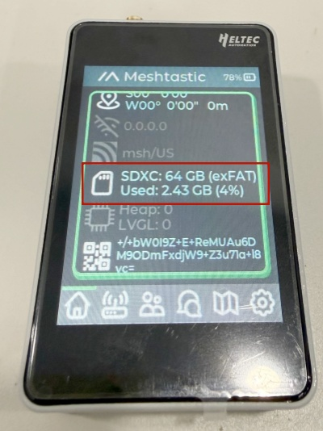
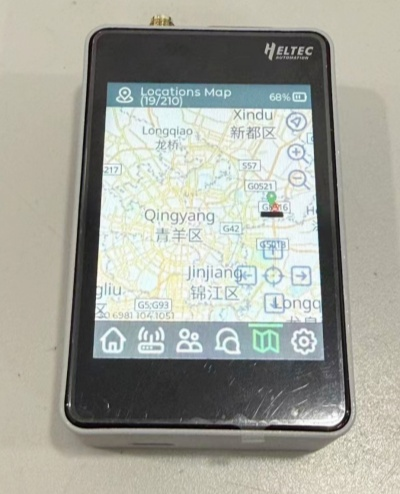

import styles from '@site/src/css/styles.module.css';


>Before using the F&T system, refer to [this document](/docs/devices/open-source-hardware/esp32-series/lora-32/wifi-lora-32-v4r8/quick-start) to complete the basic device configuration and setup.


## Flashing Meshtastic Firmware

1. Connect the device to your computer via USB-C.
2. **Enter BootLoader mode:** Press and hold the USER button, press RST once, then release the USER button.
3. Select the serial port to flash your code. After flashing is complete, press RST to restart.

:::note
  After entering Boot mode, the serial port number may change, so remember to reselect the port.
:::

:::warning
The **WiFi LoRa 32 Expansion Kit V2** currently supports local firmware flashing only.
Meshtastic firmware version **2.7.25** or later is required to support flashing for the WiFi LoRa 32 Expansion Kit V2.
The firmware is provided as a .bin file that includes both `tft` and `factory` images.


:::

---

## MUI

***After flashing the firmware, the device will enter the **MUI** interface by default. In the MUI interface, all operations are performed through the touchscreen. The **USER and IO** buttons are disabled and have no effect.***


### Touch Interaction

- **Tap on the screen:** Next option, Wake(same as USER key)  
- **Long press on the screen:** Confirm / Enter

### MUI to BaseUI

**Follow the steps below to switch from MUI to BaseUI:**

`Settings` → `Reboot/Shutdown` → `Press and hold the Bluetooth icon` → `Select OK`

---

## BaseUI

BaseUI is a simple and power-efficient interface. In this interface, touchscreen taps are only used to simulate the USER button operation.


### Button Operations

- **USER** (**Only effective in the touchscreen version of BaseUI**)

  - Single press: Next option, Wake Screen
  - Long press 2 seconds: Enter or select the current option
  - Long press and hold for 5 seconds, then release: **Turn Off Screen**

- **IO**(**Only effective in the touchscreen version of BaseUI**)

  - Single press: Back / Return
  - Long press: In the main menu, press and hold to `enter the convenient communication page` in the submenu, longpress to `exit`


- **RST:** Restart the device.
- **PWR:**	Power button. Press and hold for 3 seconds to power the device on or off.

### BaseUI to MUI 

**Follow the steps below to switch from BaseUI to MUI :**

`Long press System` → `Reboot/Shutdown` → `Switch to MUI` → `Select Yes`


---

## Sensor Setting

:::tip
If the sensor is not pre-installed, remove the rear cover of the expansion box and insert the sensor into the corresponding slot. The sensor adopts a snap-in design for easy installation. If the sensor has already been installed, skip this step.
:::


1. Complete the device connection in the Meshtastic App and ensure that the LoRa region is correctly configured.

2. Go to Settings → Telemetry.


3. Enable Environmental Monitoring and check Display on Device.


4.Tap Save to apply the settings.


5.The sensor data will then be displayed simultaneously in the App and on the device screen.


6.On devices equipped with a touchscreen, sensor data can be viewed in the Classic UI.
Navigate to the last menu tab using the User button or touch input to access the sensor data screen.


7. On devices without a touchscreen, sensor data is also displayed in the device’s Classic UI.
Users can navigate to the last menu tab using the User button to view the sensor data screen.


---

## Download Offline Map


1.Open the map download tool: https://download.tiles.coalition.space/

2.Select the map area by clicking the Rectangle Tool (Draw / Rectangle Tool) on the left toolbar, then drag on the map to define the required download region. Once finished, right-click or click the tool again to complete the selection.


3.Set Zoom Range (recommended default). Min Zoom represents the lowest zoom level (larger coverage area), and Max Zoom represents the highest zoom level (higher detail).

4.Set Download Threads (recommended default). Higher values increase download speed but may cause network instability.

5.Click Download Tiles to start downloading. A compressed file will be generated automatically.


6.**Extract the downloaded archive** to obtain the map tiles organized in the `z/x/y` directory structure.

7.**Create a `maps` folder in the root directory of the SD card, and then create a map style folder inside it.** The general directory structure is:

```text
SD:/maps/<style>/z/x/y
```

For OpenStreetMap (OSM) map tiles, `osm` is recommended as the map style folder name.

8.**Copy all extracted map tiles to the corresponding map style directory under `SD:/maps/`.** Make sure the original `z/x/y` directory structure is preserved without renaming or rearranging the folders.

For example, when using `osm`:

```text
SD:/maps/osm/{z}/{x}/{y}.png
```


9.**Insert the SD card into the expansion board and restart the device.** 

:::tip
Restarting the device is recommended to ensure that the SD card is properly detected.
:::


10.After the device starts up, check the **MUI home screen**. The SD card icon should be displayed if the SD card is detected successfully. If the SD card icon is not displayed, the SD card may not have been recognized correctly.



11.**Open the Map page** to view and use the downloaded offline map.



:::note
For more information, please refer to the official [Meshtastic documentation](https://github.com/meshtastic/device-ui/tree/master/maps).
:::