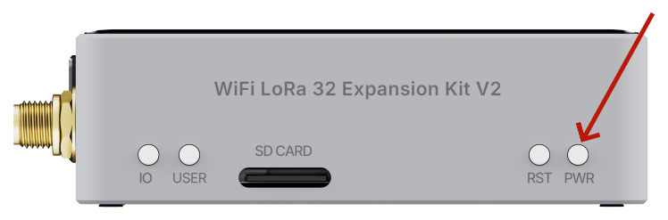

import styles from '@site/src/css/styles.module.css';

# WiFi LoRa 32 Expansion kit V2 Quick Start

## Installing the Battery
After removing the casing, you can install the battery. Battery type:
**18650 flat-top lithium battery**. Be careful not to reverse the positive and negative terminals.

## Power On/Off
Press and hold the Power button for 3 seconds to turn the device on or off.

## Charging
You can power or charge the device via the USB-C port. The applicable voltage is **5V**.

## Insert the SD card

If an SD card is required, insert it as shown in the diagram, ensuring it is oriented correctly to avoid incorrect insertion.

:::warning
Before use, make sure the SD card is formatted as **exFAT**.
:::

---

## Flash Firmware

We recommend using the Flash Download Tool to flash the firmware. For details, refer to [this document](/docs/devices/open-source-hardware/esp32-series/esp32-quick-start?esp32=meshtastic#flash-firmware-via-flash-download-tool).

## Download Offline Map

- [Meshtastic](/docs/devices/open-source-hardware/esp32-series/lora-32/wifi-lora-32-v4r8/meshtastic-qs#download-offline-map)
- [Meshcore](/docs/devices/open-source-hardware/esp32-series/lora-32/wifi-lora-32-v4r8/ft_qs#download-offline-map)
- [F&T](/docs/devices/open-source-hardware/esp32-series/lora-32/wifi-lora-32-v4r8/ft_qs#download-offline-map)

