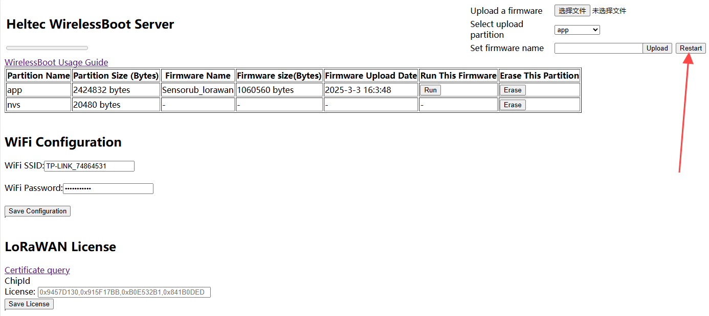

import Tabs from '@theme/Tabs';
import TabItem from '@theme/TabItem';
import styles from '@site/src/css/styles.module.css';


<Tabs
groupId="wb"
queryString="wb"
defaultValue="wb"
className={styles.customTabs}
values={[
{label: 'Upload Firmware ', value:'wb'},
{label: 'WirelessBoot Framework Installation ', value:'rede'},
]}>

<TabItem value="wb">

# Upload Firmware via WirelessBoot

## Enter WirelessBoot

1. **Different devices have different methods for entering WirelessBoot. Here, the HRI-3621 is used as an example.**Press and hold the device button until the blue light stays on. Continue holding without releasing until the purple light turns on. At this point, release the button, and the device will enter WirelessBoot mode.

2. Locate the WiFi network named "WirelessBoot-xxxx" and connect to it. Default password is “heltec.org".

   

3. In your browser, enter "192.168.4.1" and use the default password "heltec.org".<br />This is the interface for uploading firmware via WirelessBoot.

   

:::tip
You can configure the WiFi address on this page. After "Save Configuration", you can access the WirelessBoot mode through the device's IP address without needing to connect to its WiFi.
:::


### Upload Firmware

:::note
WirelessBoot only accepts firmware in “.bin” format.
:::

1. Navigate to the WirelessBoot page, choose the corresponding firmware,select an APP partition, and click "Upload."

   

:::note
The firmware name should not be too long; otherwise, it cannot be uploaded.
:::

2. After the upload is successful, click "RUN" to confirm which program you want to execute.

   

3. Click "Restart" to reboot the device and start its operation.

   


</TabItem>
<TabItem value="rede" >
# WirelessBoot Re-development

This section describes how to install and use Heltec's ESP32 WirelessBoot development framework.

If you only want to upload a pre-compiled firmware, please refer to the previous topic: [Upload Firmware Via WirelessBoot](https://docs.heltec.org/en/node/esp32/wireless_boot/upload_firmware.html).


## Install WirelessBoot Framework

1. Install [Heltec ESP32 development environment](https://github.com/Heltec-Aaron-Lee/WiFi_Kit_series/tree/WirelessBoot-Framework).

:::tip
If you don't know how to install, check out the [Readme.MD](https://github.com/Heltec-Aaron-Lee/WiFi_Kit_series/blob/master/README.md) file.
:::

2. If you already have a development environment installed, update to the latest version.

   ```
   git pull
   ```

3. Switch to the WirelessBoot branch by entering the following command:

   ```
   git branch --set-upstream-to=origin/WirelessBoot-Framework
   ```

4. Getting branch updates

   ```
   git pull
   ```


## Work with Arduino IDE
1. Enable WirelessBoot on the device, the specific method depends on the product itself.

2. On the WirelessBoot page, fill in the WiFi SSID and password, then click "Save Configuration."

3. Connect your PC and device are on the same LAN.

4. Open Arduino IDE.

5. Click `Tools`, select the appropriate `Board` and `Port`.

   

6. At this point, you can program the device through the IDE. You can choose a sample code or write your own and upload it to your device. 

   


## Serial ports

1. Download the serial port serial port plug-in:
   [Heltec Esp Network Minitor](https://resource.heltec.cn/download/Heltec%20Capsule%20Sensor%20V3/heltec-esp-network-monitor-0.0.1.vsix)

2. Access path: `C:\Users\{ueser name}\.arduinoIDE`.Create a new folder called `plugins`, If the folder already exists, there is no need to create a new one.

   

3. Copy the **Heltec Esp Network Minitor** file to the folder **plugins**.

   

4. Open Arduino IDE, Press **Ctrl+Shift+P** on your keyboard at the same time.

5. In the dialog box that pops up, search: **Heltec Esp Network Minitor**.

   

6. Click the searched plugin to enable it.

7. Open the port and connect the device's serial port to your PC via WiFi.


</TabItem>
</Tabs>
