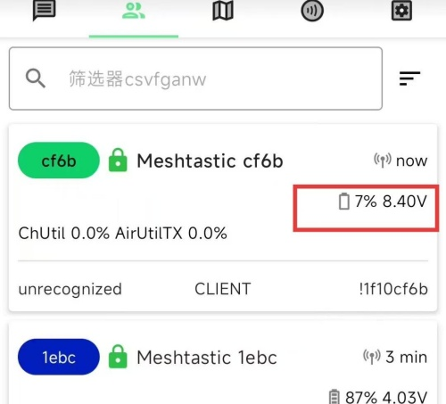

>The Meshtower V2 series is available in two variants: the Meshtower V2 standard-power version with an RF output power of 21 ±1 dBm, and the Meshtower V2H high-power version with an RF output power of 28 ±1 dBm. The setup and operating procedures are identical for both versions.

## First Charge

The Meshtower comes with preconfigured battery management settings. Once connected to an **18–24V solar panel** or a **USB-C PD3.0 (20V)** power source, and with the antenna properly installed, the device is ready for operation.

:::tip
However, before first use, it is recommended to connect an 18–24V solar panel or a USB-C PD3.0 (20V) power source to activate the battery function, and fully charge the built-in battery through the USB-C port or DC power interface to ensure more stable power delivery and optimal performance.
:::

:::danger
The power switch must be [turned on for the battery](/docs/devices/open-source-hardware/nrf52840-series/mesh-tower-v2/Usage#turn-on-the-lithium-battery-power-switch) to charge.
:::

### Via USB-C(recommended)
The USB-C port requires PD3.0 and a 20V voltage input.

### Via DC
The DC interface is the solar panel input port, which uses an XT30 connector and supports an input voltage of 18-24V.

## Turn on the Lithium Battery Power Switch

- Toggle the switch to the **Left** to turn off the Lithium Battery Power.
- Toggle the switch to the **Right** to turn on the Lithium Battery Power.

## Checking Battery Level

- You can check the battery level via the Meshtastic app on your phone.

- You can view device-related information through the serial port in the [Meshtastic client](https://client.meshtastic.org/).

## Firmware
### Pre-installed Firmware
The Meshtower comes pre-installed with [Meshtastic firmware](https://resource.heltec.cn/download/MeshTower_V1.1/firmware-heltec-mesh-tower-2.7.21.efd2613(1).uf2v). 
The default password is: **123456**. 
For instructions on how to use Meshtastic, please refer to [Meshtastic official documentation.](https://meshtastic.org/docs/introduction/)

:::tip
If the serial port cannot be detected, the device may have entered low-power mode. Please press the RST button once to restart the device and connect to it before it enters low-power mode again.
:::

### Firmware Installation and Update

You can install or update the [firmware](https://resource.heltec.cn/download/MeshTower_V1.1/firmware-heltec-mesh-tower-2.7.21.efd2613(1).uf2) via the USB-C port. 
- Meshtastic Firmware: https://resource.heltec.cn/download/MeshTower_V1.1/firmware-heltec-mesh-tower-2.7.21.efd2613(1).uf2

:::warning
The USB-C cable or port must support **USB 2.0**. If your device only supports **USB 1.x**, you may need a suitable adapter.
:::

If your installation method requires entering DFU mode, you will need to open the device casing and **double-press the RST button** to enter DFU mode.

At this point, the computer will pop up a USB drive named HT-n5262. Copy your firmware to this drive.

