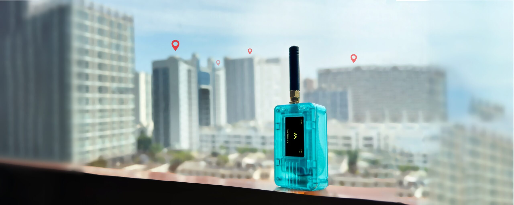

<div style={{ textAlign: 'center' }}>
  
</div>

# Heltec nRF52840 Series

nRF52840 + SX1262 mainly optimized for Meshtastic system. Heltec’s nRF52840 + LoRa series is designed for ultra-low-power wireless applications, combining Bluetooth and long-range LoRa connectivity. It is well-suited for smart cities, agriculture, logistics, and IoT deployments, and fully supports the Meshtastic open-source ecosystem.

## Usage Guide

This Usage Guide provides detailed operating instructions for the nRF52840 series nodes, offering practical guidance and best practices to help users configure, manage, and deploy their devices more efficiently.

```mdx-code-block
import DocCardList from '@theme/DocCardList';

<DocCardList />
```

