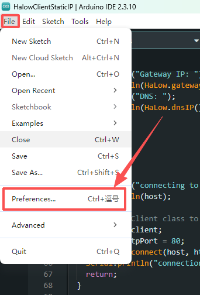
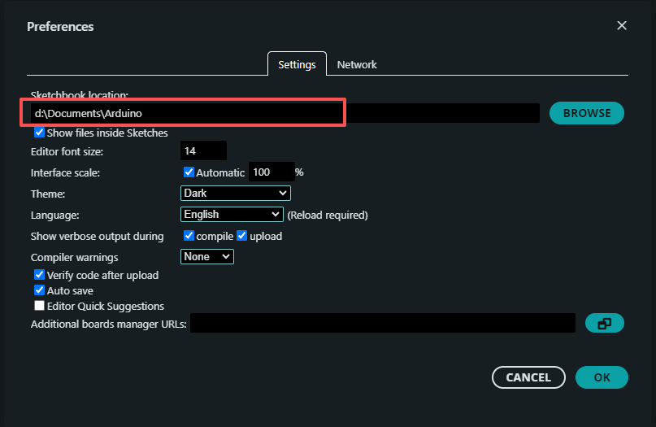
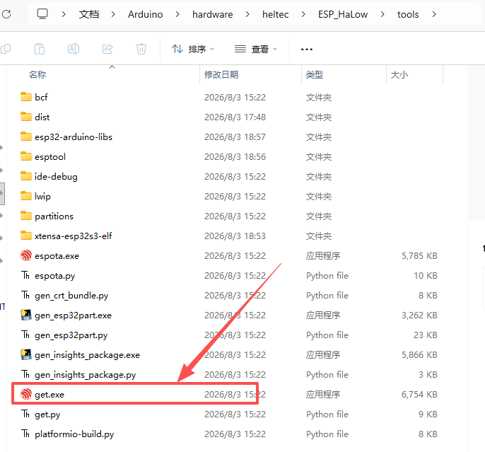
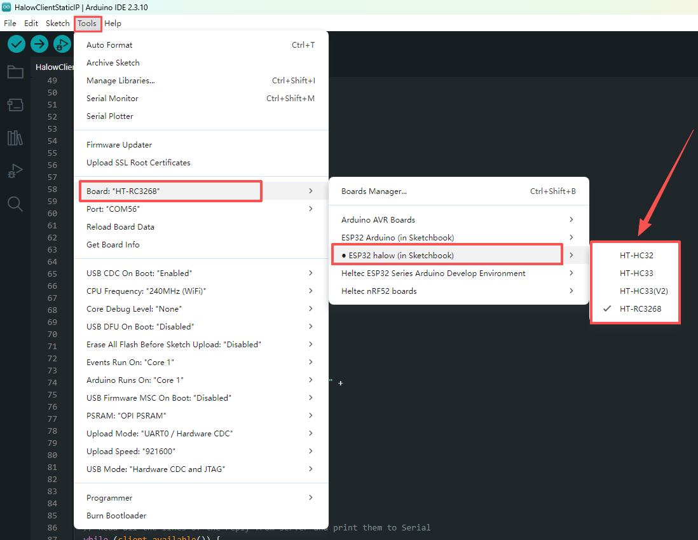
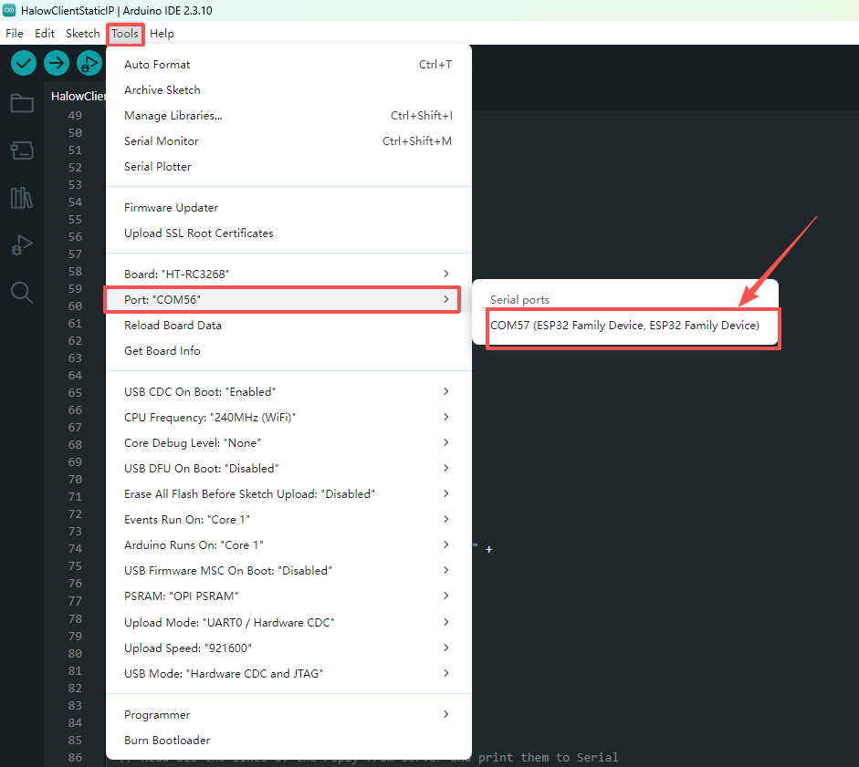
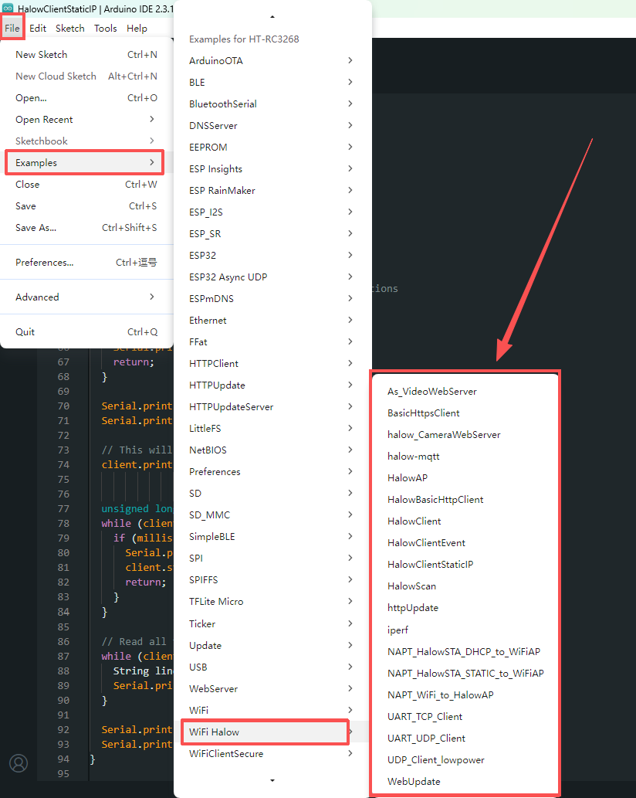

# How to Install ESP_HaLow Development Environment

:::tip
The ESP_HaLow development environment setup is similar to the [ESP32 development environment](/docs/devices/open-source-hardware/esp32-series/esp32-quick-start). 
If you are already familiar with the ESP32 setup process, you can skip this section and proceed directly to the ESP_HaLow Quick Start Guide.
:::

## Required Software

- [Arduino IDE](https://www.arduino.cc/en/software/)
- [Git](https://git-scm.com/install/windows) 
- [ESP_HaLow Development Framework](https://github.com/HelTecAutomation/ESP_HaLow#Installation-Instructions)

1. Install Arduino IDE and configure the required settings in Preferences, as shown in the following image.

2.Place the downloaded [ESP_HaLow Framework](https://github.com/HelTecAutomation/ESP_HaLow#Installation-Instructions) folder into: **`D:\Documents\Arduino\hardware\heltec`**

3.Then run: **`ESP_HaLow\tools\get.exe`** to download the required dependencies.

:::note
If get.exe fails to download the dependencies, download them manually according to:
[package_esp32_index.template.json](https://github.com/HelTecAutomation/ESP_HaLow/blob/main/package/package_esp32_index.template.json)
:::

3.Select Board and Upload Example, Restart Arduino IDE, then select:

**Tools → Board → ESP32HaLow → Select your board**

4.Select the connected device: **Tools → Port**

5.Open an ESP_HaLow example and upload it to the device. For more details, please refer to the ESP_HaLow Quick Start Guide.

