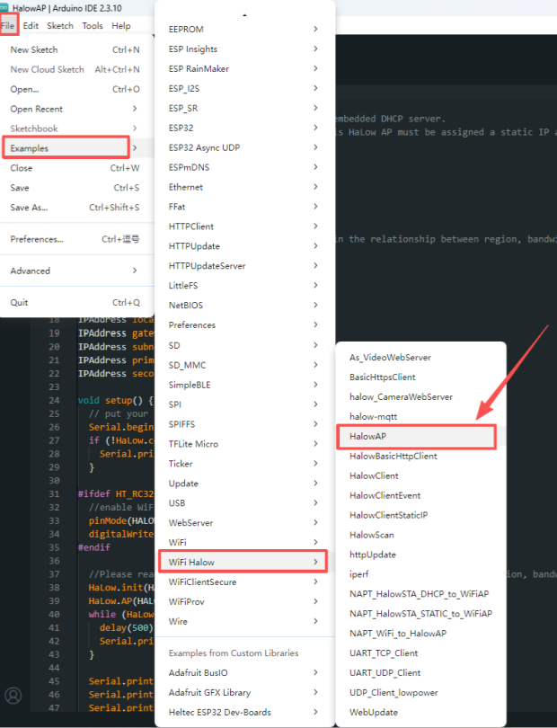
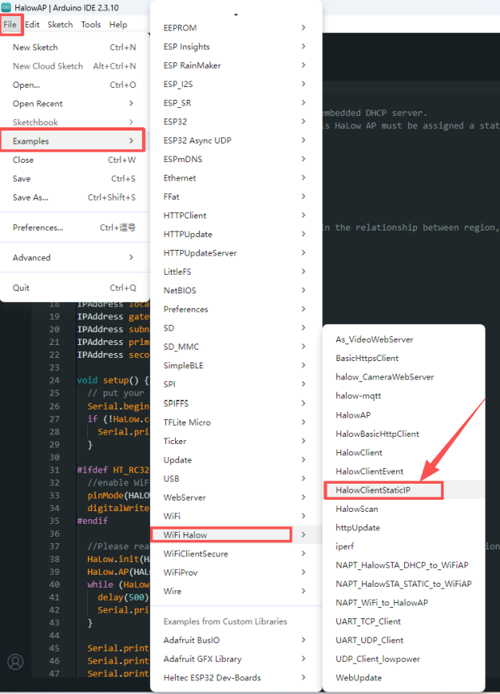
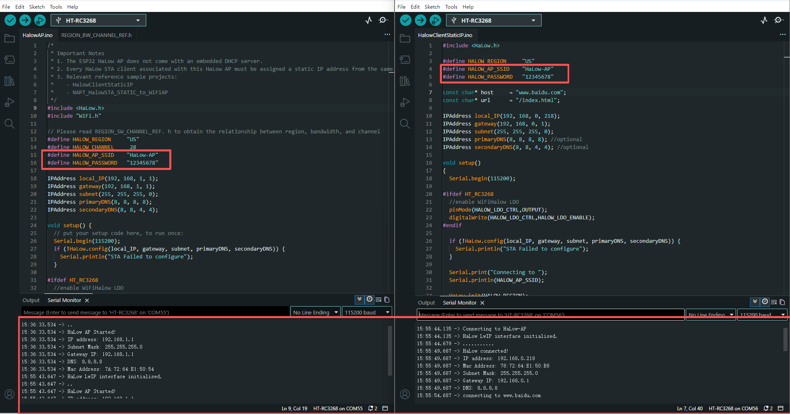
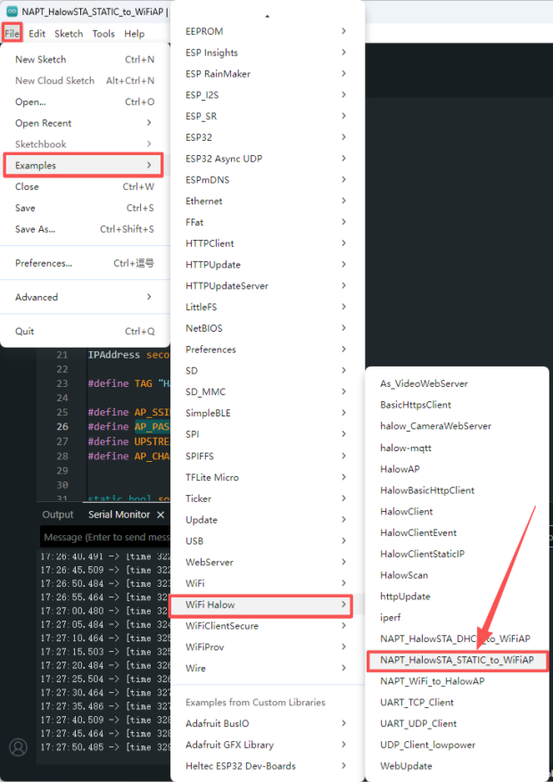
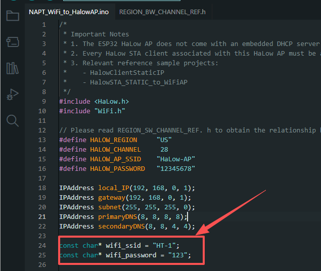
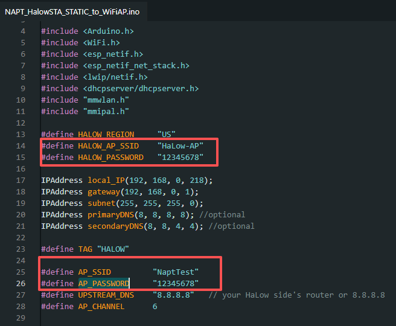
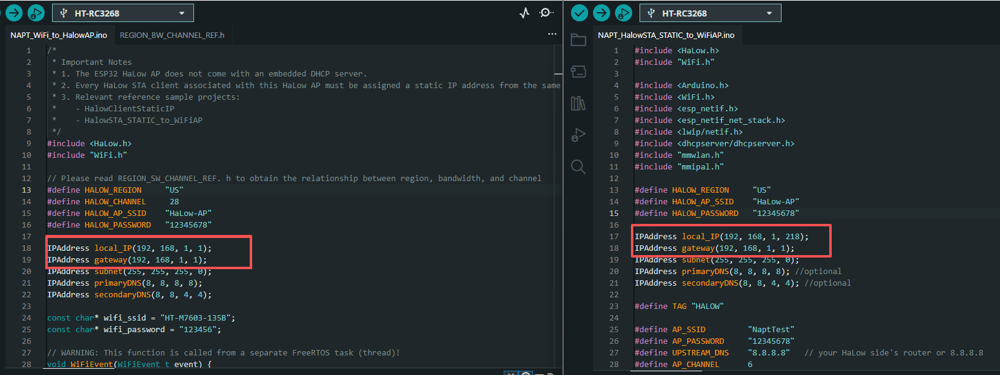
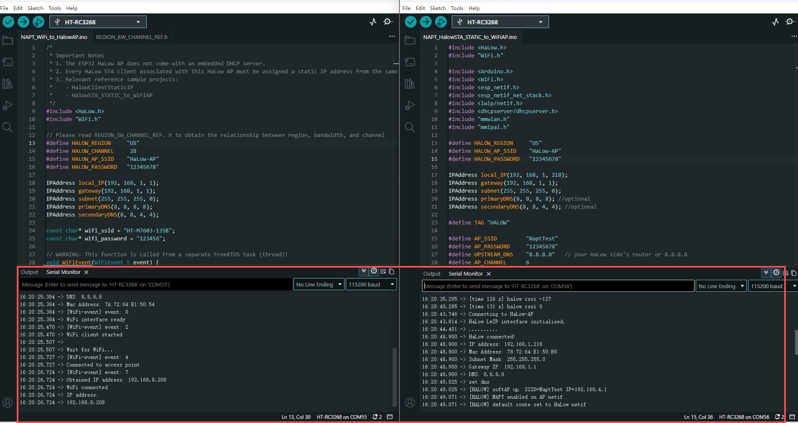

> Before getting started, refer to [this document](/docs/devices/open-source-hardware/radio_core_series/rc3268/rc3268_dev) to complete the development environment setup.

*The device supports two operating modes: **AP Mode** and **Client (STA) Mode**.*

:::danger
The **ESP32 HaLow AP** does not provide an embedded **DHCP server**. Therefore, each associated HaLow STA client must be manually configured with a **static IP** address from the same subnet as the AP to enable network communication.
:::

## Basic HaLow Communication

If you only need to establish a basic HaLow wireless connection between two devices, follow the steps below.

### AP Device

Select and upload the **HaLowAP** example code.

### Client Device

Select and upload the **HaLowClientStaticIP** example code.

:::note
Make sure the **HaLow AP SSID and Password** configured in the Cilent example match the settings in the AP example.
:::

After uploading the corresponding firmware, the two RC3268 devices can establish a HaLow connection. The successful connection can be verified through the serial monitor.

---

## WiFi and HaLow Network Communication

If you need to use WiFi as the upstream network while extending communication through HaLow, use the NAT-based examples.

### AP Device

1.Select and upload the **NAPT_WiFi_to_HaLowAP** example code.

2.Configure the **WiFi SSID and Password** in the example according to the available WiFi network. In this mode, the device connects to an external WiFi network and forwards network traffic through the HaLow AP.

### Client Device

1.Select and upload the **NAPT_HaLowSTA_STATIC_to_WiFiAP** example code.

2.Configure the following parameters:

- **HALOW_AP_SSID and Password:** Must match the values of `HALOW_AP_SSID` and `HALOW_PASSWORD` defined in the `NAPT_WiFi_to_HaLowAP` example code.
- **AP_SSID and Password:** Can be customized. This creates the WiFi network that downstream devices can connect to.

:::warning
For IP-based communication, the HaLow AP and Client devices must be configured within the **same subnet**. The example code has already been configured with IP addresses in the same subnet, and it is recommended not to modify these settings unless required.
:::

3.After configuring the required parameters and uploading the corresponding firmware, the RC3268 devices can establish both **HaLow and WiFi connections**. The successful connection can be verified through the serial monitor.

