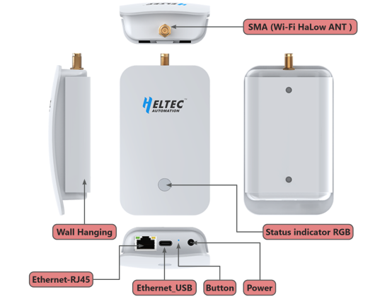

import styles from '@site/src/css/styles.module.css';

## Summary

  

HT-H7608 is an innovative WiFi HaLow gateway from Heltec Automation designed to meet the needs of long-distance/high-speed data transmission for IoT applications. The gateway uses WiFi HaLow (IEEE 802.11ah) technology that operates in the sub-1 GHz unlicensed band, which has stronger penetration and larger coverage compared with the traditional WiFi standard.

{

  <a href="https://heltec.org/project/ht-h7608/" className={styles.btnLink1}>
    Product Page
  </a>

}

## Product characteristics

- Wi-Fi and Ethernet supported, WiFi HaLow and 2.4GHz dual-band design
- Long-distance transmission capability
- Supports access to a large number of devices
- High transmission speed
- Flexible networking methods, including AP, STA, Mesh, etc

## Important parameters
| [parameters](https://resource.heltec.cn/download/HT-HC01/Datasheet/HT-HC01.pdf)         | HT-H7608          |
|--------------------|----------------------------|
|MCU     |	   	MT7628               |
|Wi-Fi HaLow Standard  |     	IEEE 802.11ah             |
| Wi-Fi Standard      |   	IEEE 802.11b/g/n               |
|Flash          | 	32M          |
| RAM            |  	128M|
| Power Supply         |   	5V/1~2A DC   |

## Important Resources

- [Datasheet](https://resource.heltec.cn/download/HT-H7608/HT-H7608_1.0.pdf)
- [Related links](https://resource.heltec.cn/download/WiFi_LoRa_32_V3/)

