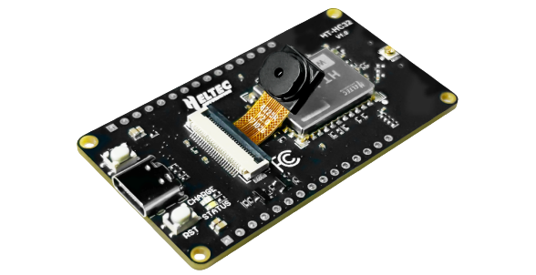

import styles from '@site/src/css/styles.module.css';

  

ESP-HaLowCamera is a development board with integrated camera, based on the ESP32-S3 MCU and Wi-Fi HaLow module. It is designed for long-range, high-speed wireless communication. With support for transmission distances of over 1 km and speeds of up to 32 Mbps, it is ideal for IoT applications that require reliable, high-performance connectivity.

{

  <a href="https://heltec.org/project/ht-hc32/" className={styles.btnLink1}>
    Product Page
  </a>

}

## Product characteristics

- ESP32-S3 MCU with Wi-Fi, Bluetooth, and Wi-Fi HaLow
- 1 ~2 km range and up to 32 Mbps speed
- Low power with strong penetration
- Built-in 2MP camera and SD card slot
- Type-C, CP2102, battery management, RF shielding

## Important parameters
| [parameters](https://resource.heltec.cn/download/HT-HC32/Datasheet/HT-HC32.pdf)         | HT-HC32       |
|--------------------|----------------------------|
|MCU     |	   		ESP32-S3R8            |
|Serial port chip  |     		CP2102           |
|HaLow Standard     |   	IEEE 802.11ah           |
|Power Supply    | 			5V@USB, 2.7~4.2V@battery     |
|Operating temperature         |  		-30 ~ +85℃|
|Dimensions       |   60.00*33.50*7.10mm |

## Important Resources
- [Datasheet](https://resource.heltec.cn/download/HT-HC32/Datasheet/HT-HC32.pdf)
- [Schematic Diagram](https://resource.heltec.cn/download/HT-HC32/Schematic_diagram)
- [development framework on GitHub](https://github.com/HelTecAutomation/ESP_HaLow)

