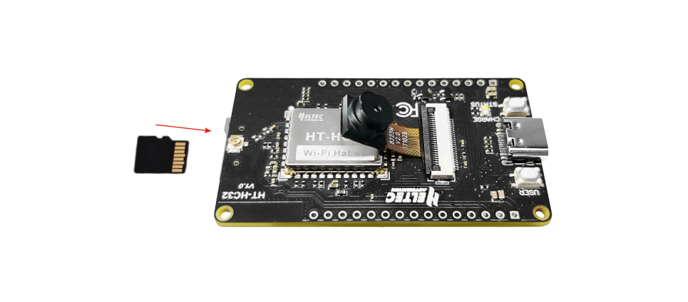
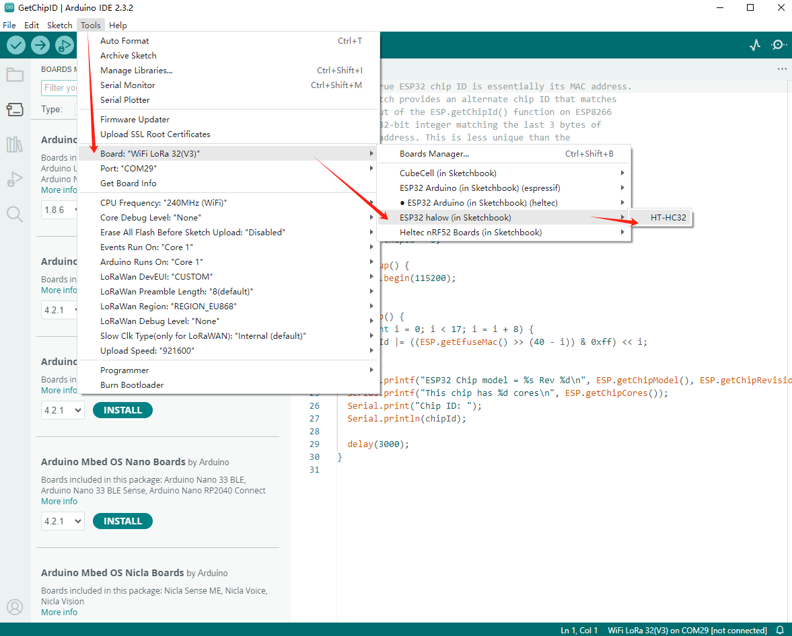
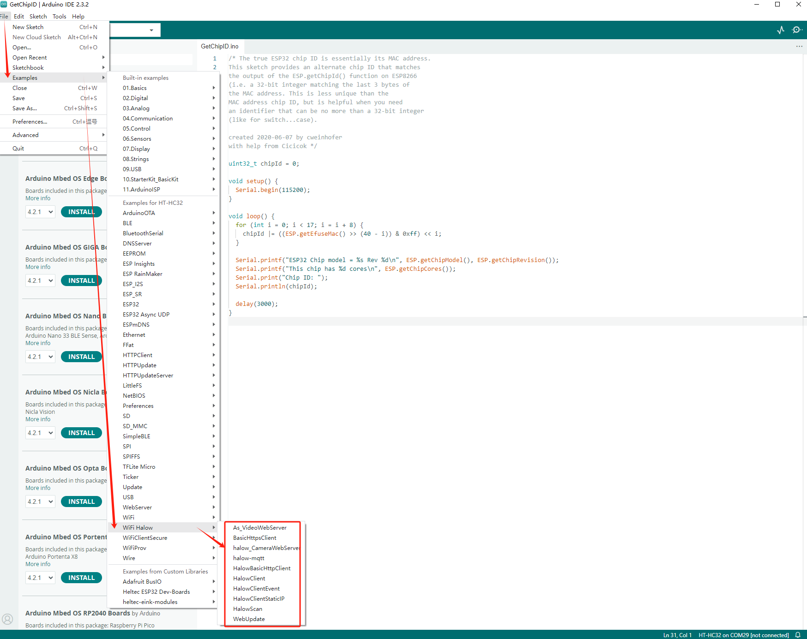

# HC32 Get started

### Required Hardware

- [ESP-HaLowCamera](https://heltec.org/project/ht-hc32/)
- USB Type-C cable
- Computer running Windows, Linux, or macOS

:::note
Be sure to use an appropriate USB cable. Some cables are for charging only and do not provide the needed data lines nor work for programming the boards.
:::

### Hardware Connection

The installation direction of SD card and camera is shown below.

### Required Software

- [Arduino IDE](https://www.arduino.cc/en/software)
- [Git](https://git-scm.com/downloads/win) (GitHub installation required)

### Installing the development framework

Heltec provides an Arduino-based development framework that includes basic ESP32 code and sample Wi-Fi HaLow code.

For installation, please refer to this link:  
[Heltec ESP_HaLow Development Framework Installation Guide](https://github.com/HelTecAutomation/ESP_HaLow)

### Programming

Once you have the framework and libraries installed, connect your computer to the board and start programming nodes.

#### Example

1. Connect your node to the computer with a USB cable.
2. Open **Arduino IDE** -> **Tools**, correctly select the board.

3. Select **File** -> **Example** to find the example you want. The location of the Wi-Fi HaLow related code is circled in the figure below.

4. Adapt your code to your needs.  
5. Compile & Upload.

