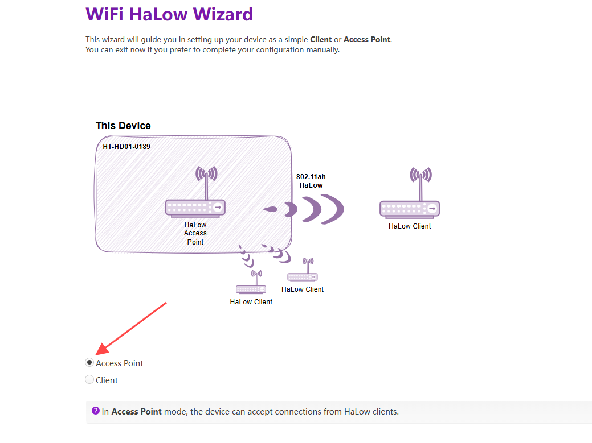

import Tabs from '@theme/Tabs';
import TabItem from '@theme/TabItem';
import styles from '@site/src/css/styles.module.css';

# HT-HD01 Mesh Mode User Guide

<Tabs
groupId="ap"
queryString="ap"
defaultValue="ap"
className={styles.customTabs}
values={[
{label: 'AP Setup Guide ', value:'ap'},
{label: 'STA Setup Guide ', value:'sta'},
]}>

<TabItem value="ap">

**This document describes how to configure the HD01 in AP(Access Point) mode.**

1. Please ensure you have accessed the device's configuration page. If you need guidance on accessing the configuration interface, please refer to this link:

[Access Configuration](/docs/devices/wifi-halow/ht-hd01/access_configuration_page)

2. For devices not in configuration mode: Simply click **Wizards** to proceed. 

For configuration mode access, the following parameters must be set:
- **Country**, Only devices with the same Country setting can communicate with each other.
- **Hostname**, refers to the hostname of your device in the Wi-Fi HaLow network. 

3. Select "**Standard WiFi HaLow**", click `next`.

4. Select `Access Point` mode and click `Next`.

5. Set the parameters for the HaLow hotspot and click `Next`.

- **SSID**: Wi-Fi HaLow hotspot name. The STA must establish connectivity through it.
- **Password**: Wi-Fi HaLow hotspot password.
- **Bandwidth**: Different bandwidth configurations affect signal coverage, data transfer rate, and interference resistance. Narrower bandwidths (e.g., 1 MHz) offer better coverage and lower power consumption, while wider bandwidths provide higher data rates but have shorter range and higher power consumption.
- **Channel**: Each bandwidth has specific frequencies as its channels. When there are other Wi-Fi HaLow devices in the area, you can reduce interference by setting different channels.

6. Select the **Upstream Network** connection method and **Traffic Mode**. The upstream network determines the device's internet access method, while **Traffic Mode** governs how downstream devices obtain IP addresses. Regardless of your selection, the topology diagram and on-screen instructions will dynamically update to reflect your configuration. 

7. Enable/Disable "2.4GHz WiFi AP", Set the SSID and password for the 2.4GHz hotspot, then click **Next**. If don't have stringent low-power requirements, we recommend enabling this feature to facilitate subsequent device management.

8. Click **Apply** to complete the device configuration. 

9. If using an Ethernet cable as your upstream network, remember to connect the cable. Upon successful network connection, the device indicator will maintain a solid cyan or purple illumination. 

:::warning
The RJ45 cable is indicated by cyan, while the USB-C cable is indicated by purple. If the LED color doesn't match your selected cable type, press the function button to toggle between modes.
:::

</TabItem>
<TabItem value="sta" >

**This document describes how to configure the HD01 in STA(Station/client) mode.**

1. Please ensure you have accessed the device's configuration page. If you need guidance on accessing the configuration interface, please refer to this link:

[Access Configuration](/docs/devices/wifi-halow/ht-hd01/access_configuration_page)

2. For devices not in configuration mode: Simply click **Wizards** to proceed. 

For configuration mode access, the following parameters must be set:
- **Country**, Only devices with the same Country setting can communicate with each other.
- **Hostname**, refers to the hostname of your device in the Wi-Fi HaLow network. 

3. Select "**Standard WiFi HaLow**", click `next`.

4. Select `Client` mode and click `Next`.

5. Scan or manually enter the SSID and password of the HaLow-AP, and click `Next`.

5. Select **Traffic Mode**, which determines the downstream network mode provided by this MeshPoint device. Regardless of your selection, the topology diagram and on-screen instructions will dynamically update to reflect your configuration. 

7. Enable/Disable "2.4GHz WiFi AP", Set the SSID and password for the 2.4GHz hotspot, then click **Next**. This 2.4GHz access point is configured for your terminal devices. The hotspot must remain enabled, otherwise its Wi-Fi functionality will be unavailable.

</TabItem>
</Tabs>
