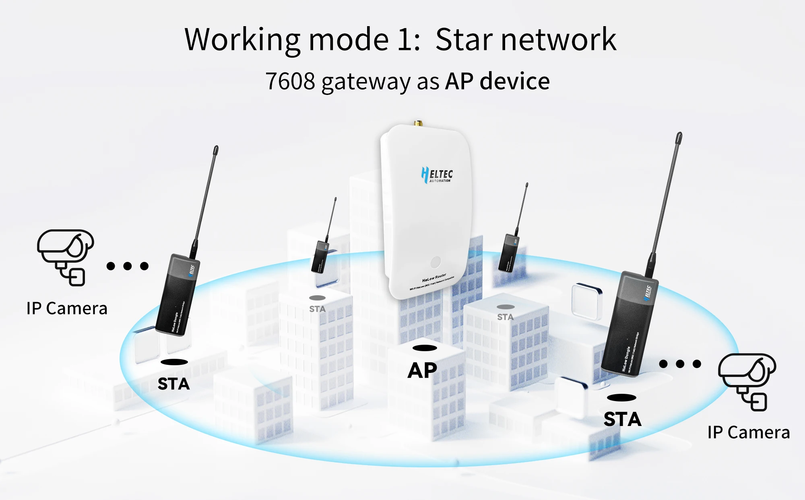

import styles from '@site/src/css/styles.module.css';

<iframe
  width="100%"
  height="400"
  src="https://www.youtube.com/embed/yv7G51lyqAw?start=29s"
  title="Dongle"
  frameborder="0"
  allow="accelerometer; autoplay; clipboard-write; encrypted-media; gyroscope; picture-in-picture"
  allowfullscreen
></iframe>

HT-HD01 is a plug-and-play long-range communicator based on Wi-Fi HaLow that can replace Ethernet cables in certain scenarios. Pair two devices for use, or work with the HaLow gateway.

{

  <a href="https://heltec.org/project/ht-hd01/" className={styles.btnLink1}>
    Product Page
  </a>

}

## Product characteristics
- Long transmission range, up to 1km
- Plug and play, simple configuration
- IEEE 802.11ah standard
- Both Wi-Fi and Ethernet supported, WiFi HaLow and 2.4GHz dual-band design
- Seamlessly connected to traditional networks

## Important parameters
| [parameters](https://resource.heltec.cn/download/HT-HR01/Datasheet/HT-HR01_V1.0.0.pdf)         | HT-HD01       |
|--------------------|----------------------------|
|MCU     |	   		MT7628          |
|Consumption  |     		300mA(Typical)         |
|HaLow Standard     |   	IEEE 802.11ah           |
|Power Supply    | 			USB-C, 5V  |
|Operating temperature         |  		-20~ +70℃|
|Dimensions       |  87.5 *32.5 *20mm |

## Important Resources
- [Datasheet](https://resource.heltec.cn/download/HT-HD01/HT-HD01_Rev.1.0.0.pdf)
- [Firmware](https://resource.heltec.cn/download/HT-HD01/firmware)
- [Related links](https://resource.heltec.cn/download/HT-HD01/)

## Network Modes

### AP-STA: Point to Point

### AP-STA: Star Topology

### AP-STA: LAN

### Mesh Networking

