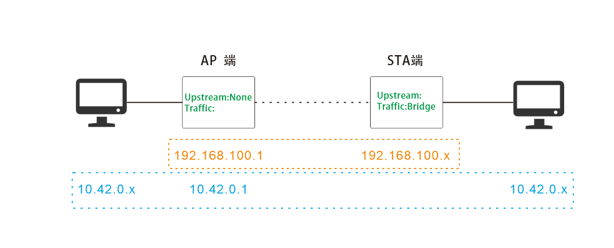

**WiFi HaLow devices can form a LAN, allowing communication between connected devices**.

## Working Principle
Here are some key tips to help you achieve more networking configurations:
- All connected devices must obtain IP addresses from the same device, regardless of the network type they are connected to.
- Bridge mode does not handle IP assignment, whether on the AP or STA side. The responsibility for IP allocation lies with the higher-level device.
- In the HD01 configuration page diagram, you can see IP addresses are connected, .

## Common Examples
### Example 1: LAN without Router
A common method is to set the AP to None mode and the STA to BRIDGE mode. By configuring the AP in None mode, you eliminate the need for an external router, while setting the STA to Bridge mode ensures it doesn't participate in IP allocation, allowing all devices on the network to obtain IP addresses directly from the AP and establish connectivit.

1.  **AP Setup**
    When configuring the AP side, set its **Upstream Network** to **None**. If you are unsure how to configure AP mode, please refer to this link:
    [AP Setup Guide](/docs/devices/wifi-halow/ht-hd01/ap?ap=ap)

    

2. **STA Setup**
    When configuring the STA side, set its **Traffic Mode** to **Bridge**. If you are unsure how to configure STA mode, please refer to this link:
    [STA Setup Guide](/docs/devices/wifi-halow/ht-hd01/ap?ap=sta)

-----------------------------------

## Related Links
- [Access Configuration Page](/docs/devices/wifi-halow/ht-hd01/access_configuration_page)
- [HaLow AP-STA](/docs/devices/wifi-halow/ht-hd01/ap?ap=ap)
- [Mesh Point](/docs/devices/wifi-halow/ht-hd01/meshgate?mg=mp)