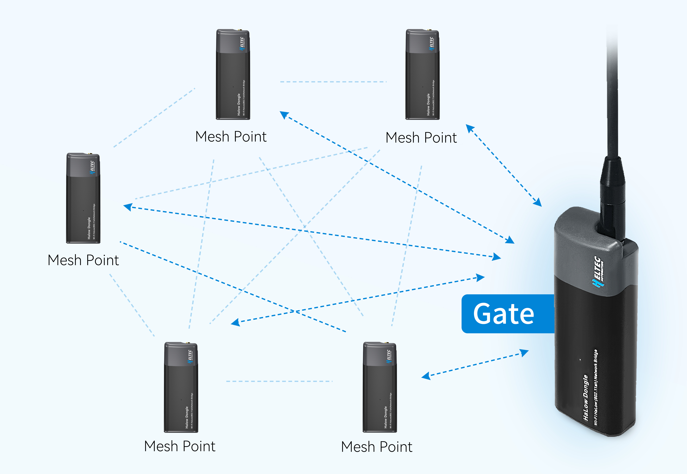
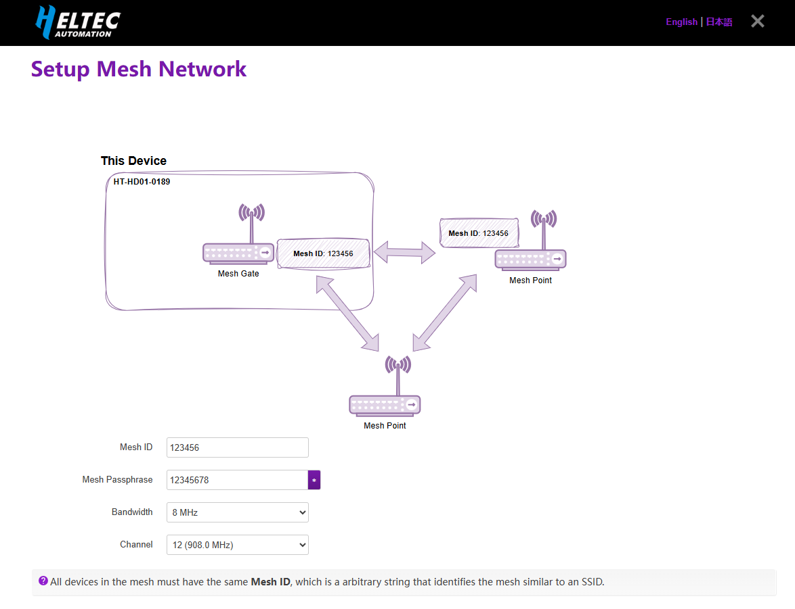
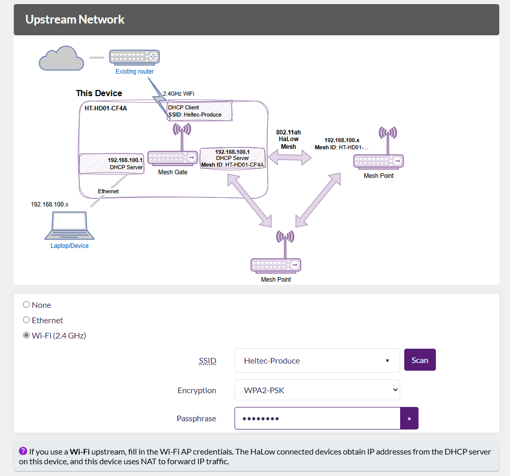

import Tabs from '@theme/Tabs';
import TabItem from '@theme/TabItem';

The HD01 supports Mesh networking mode, and you can even use it to achieve relay functionality. However, please note the following three points:

- In this mode, one node must act as the MeshGate to connect to the upstream network, while the other nodes serve as MeshPoints.
- In this mode, only devices with the same MeshID can communicate with each other.
- The transmission rate decreases by 50% with each relay.

  

<Tabs
groupId="mg"
queryString="mg"
defaultValue="mg"
values={[
{label: 'MeshGate Setup Guide ', value:'mg'},
{label: 'MeshPoint Setup Guide ', value:'mp'},
]}>

<TabItem value="mg">

**This document describes how to configure the HD01 in Mesh Gate mode.**

1. Please ensure you have accessed the device's configuration page. If you need guidance on accessing the configuration interface, please refer to this link:

[Access Configuration](/docs/devices/wifi-halow/ht-hd01/access_configuration_page)

2. For devices not in configuration mode: Simply click **Wizards** to proceed. 

For configuration mode access, the following parameters must be set:
- **Country**, Only devices with the same Country setting can communicate with each other.
- **Hostname**, refers to the hostname of your device in the Wi-Fi HaLow network. 

3. Select "**802.11s Mesh Wizard**", click `next`.

4. Select "**Mesh Gate**", click `next`.

5. Set the relevant parameters in the pop-up page, with the parameter descriptions as follows:

- **Mesh ID** & **Passphrase**, Set a Mesh ID and passphrase, and only devices with the same ID and Passphrase can form a Mesh network.
- **Bandwidth** & **Channel**, Available Bandwidths and Channels differ greatly across regions. The higher your bandwidth, the greater the potential throughput of the connection. If you're deploying multiple HaLow access points you may want to select distinct channels and a lower bandwidth to reduce interference.

6. Select the **Upstream Network** connection method and **Traffic Mode**. The upstream network determines the device's internet access method, while Traffic Mode governs how downstream devices obtain IP addresses. Regardless of your selection, the topology diagram and on-screen instructions will dynamically update to reflect your configuration. 

If Wi-Fi is selected as the upstream network, enter the SSID and password of the target network connection here.

7. Enable/Disable "2.4GHz WiFi AP", Set the SSID and password for the 2.4GHz hotspot, then click **Next**.

:::tip
If don't have stringent low-power requirements, we recommend enabling this feature to facilitate subsequent device management.
:::

8. Click **Apply** to complete the device configuration. 

9. If using an Ethernet cable as your upstream network, remember to connect the cable. Upon successful network connection, the device indicator will maintain a solid cyan or purple illumination. 

:::warning
The RJ45 cable is indicated by cyan, while the USB-C cable is indicated by purple. If the LED color doesn't match your selected cable type, press the function button to toggle between modes.
:::

</TabItem>
<TabItem value="mp" >

**This document describes how to configure the HD01 in Mesh Point mode.**

1. Please ensure you have accessed the device's configuration page. If you need guidance on accessing the configuration interface, please refer to this link:

[Access Configuration](/docs/devices/wifi-halow/ht-hd01/access_configuration_page)

2. For devices not in configuration mode: Simply click **Wizards** to proceed.

For configuration mode access, the following parameters must be set:
- **Country**, Only devices with the same Country setting can communicate with each other.
- **Hostname**, refers to the hostname of your device in the Wi-Fi HaLow network. 

3. Select "**802.11s Mesh Wizard**", click `next`.

4. Select "**Mesh Point**", click `next`.

5. Set the relevant parameters in the pop-up page, with the parameter descriptions as follows:

- **Mesh ID** & **Passphrase**, Set a Mesh ID and passphrase, and only devices with the same ID and Passphrase can form a Mesh network.
- **Bandwidth** & **Channel**, Available Bandwidths and Channels differ greatly across regions. The higher your bandwidth, the greater the potential throughput of the connection. If you're deploying multiple HaLow access points you may want to select distinct channels and a lower bandwidth to reduce interference.

After completing the above steps, click `Next`.

5. Select **Traffic Mode**, which determines the downstream network mode provided by this MeshPoint device. Regardless of your selection, the topology diagram and on-screen instructions will dynamically update to reflect your configuration. 

7. Enable/Disable "2.4GHz WiFi AP", Set the SSID and password for the 2.4GHz hotspot, then click **Next**.

:::tip
If don't have stringent low-power requirements, we recommend enabling this feature to facilitate subsequent device management.
:::

8. Click **Apply** to complete the device configuration. 

9. If using an Ethernet cable as your upstream network, remember to connect the cable. Upon successful network connection, the device indicator will maintain a solid green or blue illumination. 

:::warning
The RJ45 cable is indicated by green, while the USB-C cable is indicated by blue. If the LED color doesn't match your selected cable type, press the function button to toggle between modes.
:::

</TabItem>
</Tabs>