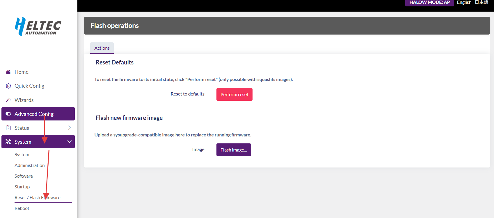

[Firmware Download Link](https://resource.heltec.cn/download/HT-HD01/firmware)

1. Access the Configuration Page. For entry methods, refer to: [Access Configuration Page](/docs/devices/wifi-halow/ht-hd01/access_configuration_page)

2. Navigate to Firmware Update. Click: `Advanced Config` → `System` → `Reset/Flash Firmware` → `Flash Image`

3. Select `Browse`, Choose target firmware, click `Upload`, Waiting for firmware upload to complete...

4. Select whether to **"keep settings and retain the current"** configurations

