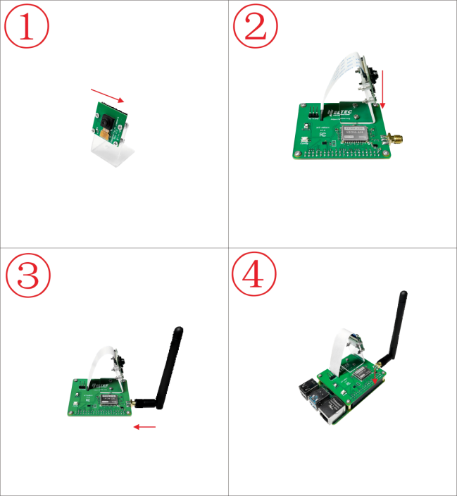
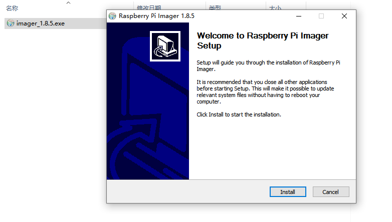
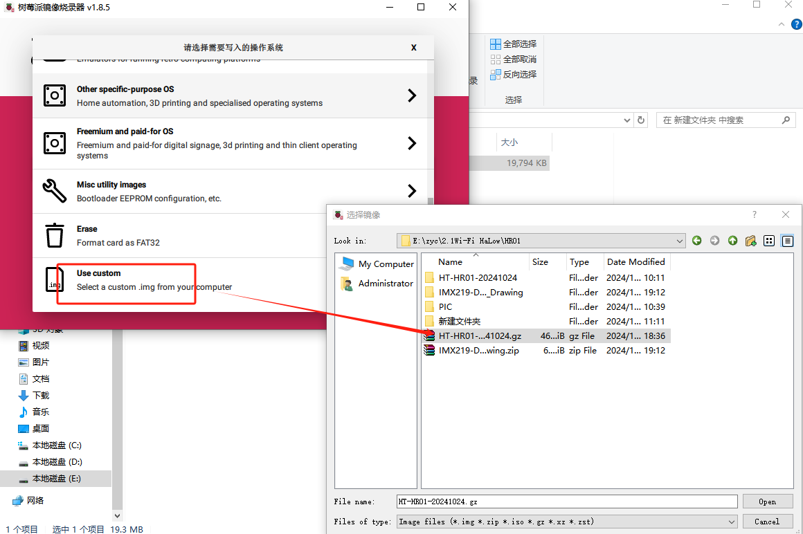
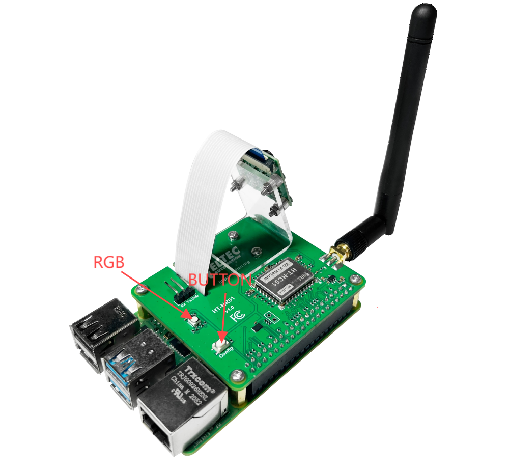

# HR01 Get started

### Hardware

#### Hardware Preparation
- [Pi-CamLow](https://heltec.org/project/ht-hc32/)
- [Raspberry Pi 4 Module B](https://heltec.org/project/raspberry-pi4-model-b/)
- Micro SD card
- SD card reader
- Computer running Windows, Linux, or macOS

#### Hardware Installation

Follow the steps shown below to install and connect the device.

#### Power

HR01 is powered by Raspberry PI, so it is sufficient to connect the Raspberry PI power supply.

### Install firmware

1. Download the [HR01_Firmware](https://resource.heltec.cn/download/HT-HR01/Firmware/HT-HR01-20241024.gz) and [Raspberry Pi Imager](https://www.raspberrypi.com/software/).
2. Insert the SD card into the card reader and connect it to your computer.
3. Install and run the **Raspberry Pi Imager tool**.

4. Select the appropriate Raspberry Pi model. Select `Use custom`. Then choose the **HR01_Firmware** you just downloaded.

5. Click `NEXT` and complete the firmware installation.
6. Remove the SD card from the card reader and insert it into the Raspberry Pi.

### Setup and Use

1. Powering on the device, the red indicator light should turn on, indicating that the device is starting up (takes a few dozen seconds).
2. Connect your Raspberry PI to your computer with an Internet cable.

3. Press and hold the device button for 3 seconds until the yellow light turns on, then release the button.  
4. Open the web browser on your computer and go to `10.42.0.1`.

- Default username: **root**  
- Default password: **heltec.org**

5. Select the mode you want to run and configure it accordingly.  
 

