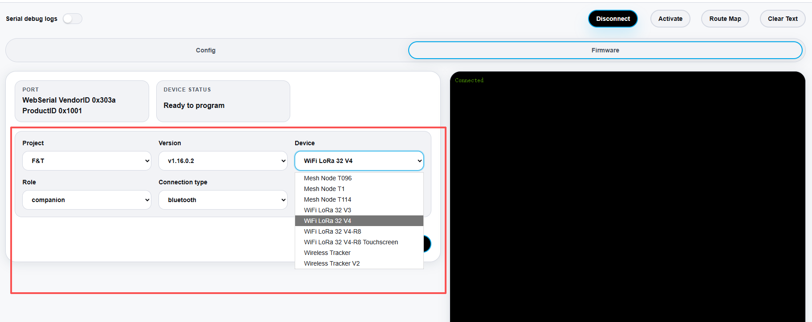
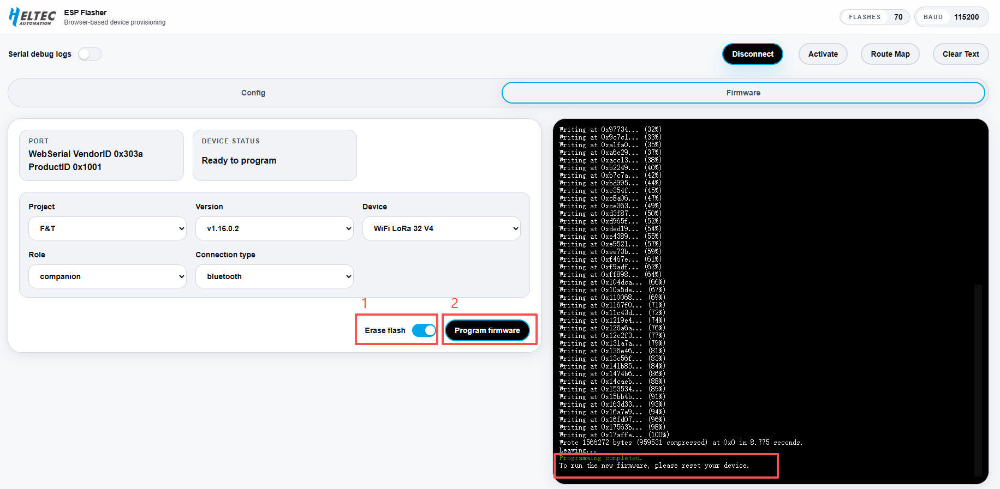
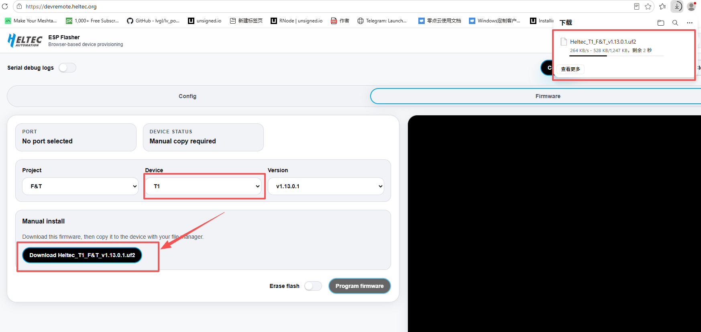
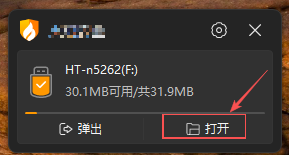
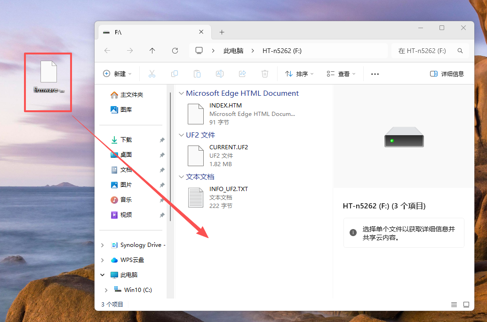
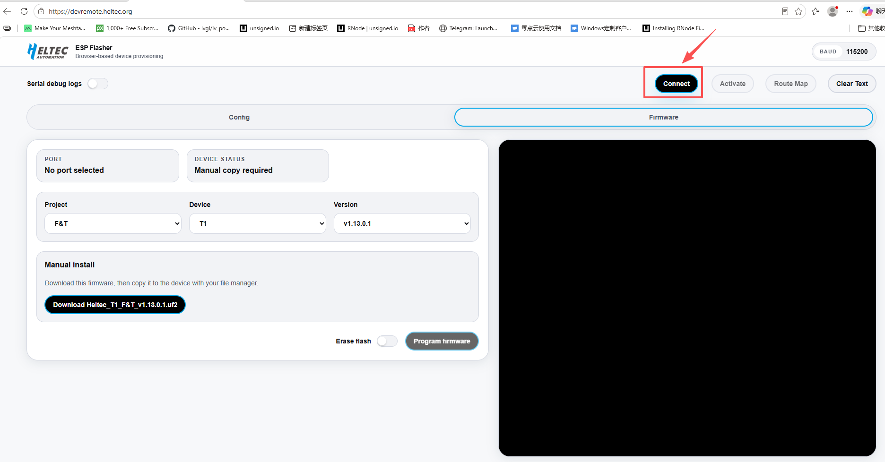
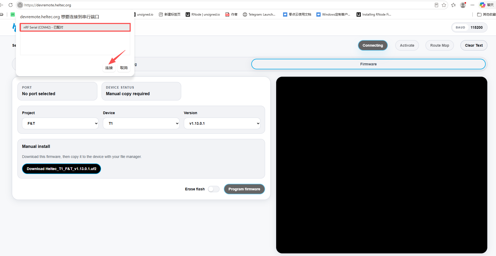
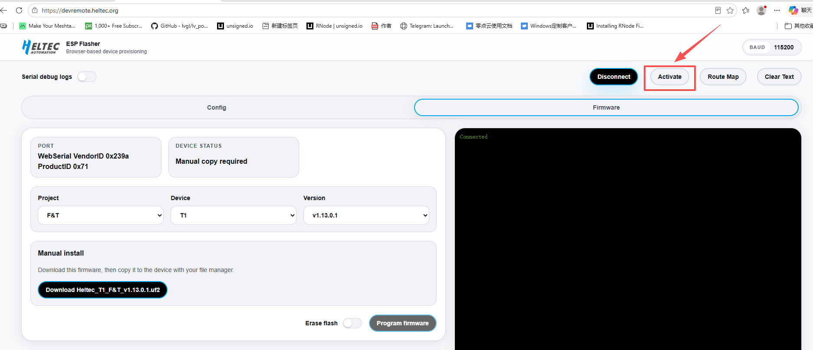

import Tabs from '@theme/Tabs';
import TabItem from '@theme/TabItem';
import styles from '@site/src/css/styles.module.css';

# Flash F&T Firmware

<Tabs
groupId="flash"
queryString="flash"
defaultValue="flash"
className={styles.customTabs}
values={[
{label: 'ESP32 Flash Firmware', value:'flash'},
{label: 'nRF52840 Flash Firmware', value:'nrf'},
]}>

<TabItem value="flash">

***Follow the steps below to flash the F&T firmware:***

1. Connect the device to your computer using a USB cable.

2. **Enter Bootloader mode:**  Press and hold the **USER or PRG button**, then press and release the **RST button**, and finally release the **USER or PRG button**. The device will enter Bootloader mode and become ready for firmware flashing.

:::note
  After entering Boot mode, the serial port number may change, so remember to reselect the port.
:::

3. Open the firmware flashing page: https://devremote.heltec.org/

4. Click **Connect**.

   

5. Select the corresponding **COM port**, then click **Connect** again.

   
   
   Once the device is successfully connected, the connection status will be displayed on the right side of the page.

6. Configure the flashing options:

   - **Project:** Select **F&T**.  
   - **Device:** Select the corresponding device model.
   - **Connection Type:** Select the connection method **WiFi**, **Bluetooth**, or **USB**.
  
   

:::tip
Currently, F&T is the only available project. More open-source projects may be added in the future.
:::

7. After completing the configuration: `Click Erase Flash` --> `Click Program Firmware`
   
   
   
   

   The tool will automatically complete the firmware flashing process. Once the flashing process is completed successfully, press the **RST button** once to restart the device.

---   

</TabItem>
<TabItem value="nrf">

1.Open the Heltec Device Remote platform: https://devremote.heltec.org/

2.Select the **nRF device** from the device list, then click **Download Firmware.**

3. Connect the device to your computer via a USB cable, then **Double-Press** the designated button to enter **DFU Mode**. Once in DFU mode, the device will be recognized by the computer as a storage device.

   - **Mesh Node T1:** Double-press the **Power Button.**
   - **Mesh Node T114 / T096:** Double-press the **RST button.**

   

4. Copy the downloaded the **F&T Firmware File** to the device storage.

5. After the file transfer is completed, the device will automatically restart and complete the firmware flashing process.

---

</TabItem>
</Tabs>

:::warning
After flashing the F&T firmware, the device must be activated through the [Device Remote platform](https://devremote.heltec.org/) before use.
:::

## Activate the Device

***Please follow the steps below to activate the device:***

1. On the [Device Remote page]( https://devremote.heltec.org/), click **Connect**.

2. Select the corresponding serial port and click **Connect**.

3. After the connection is established, click **Activate**. 

4.The device will be activated automatically. Once activated, the device is ready to use the F&T system.

---