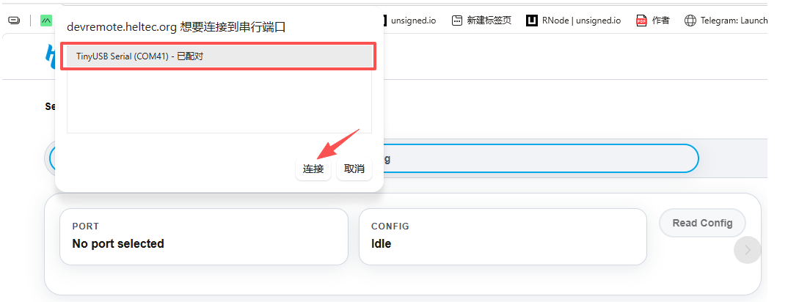
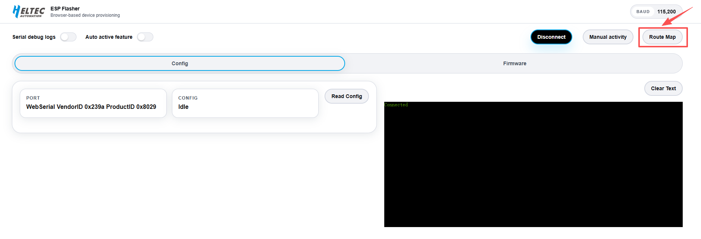

The **GPS Track** feature records the device's movement using GPS. After **GPS Track** is enabled, the device automatically records track points as it moves. The recorded track can then be viewed on a computer using the [**DevRemote**](https://devremote.heltec.org/) tool.

## Access GPS

First, [**navigate to the GPS**](/docs/platform/f&t/qs/gps) function on the device.

Enable the **`GPS Track`** feature in **GPS** .

### View Track

1. Connect the device to a computer via a USB cable.

3. Open [**DevRemote**](https://devremote.heltec.org/).

4. Click **Connect**.

   

5. Select the serial port associated with the connected device.

   

6. Click **Route Map**. The tool automatically detects the number of track points recorded on the device.

   

:::tip
Current logging rule: one point is recorded approximately every 50 meters of movement, Up to 600 track points can be stored.
:::

