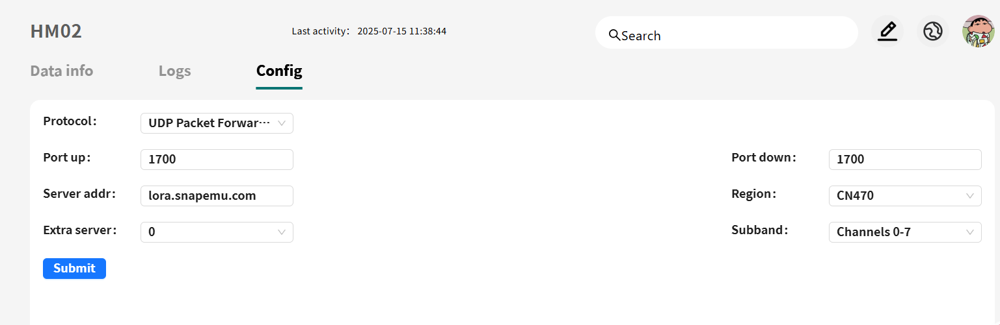
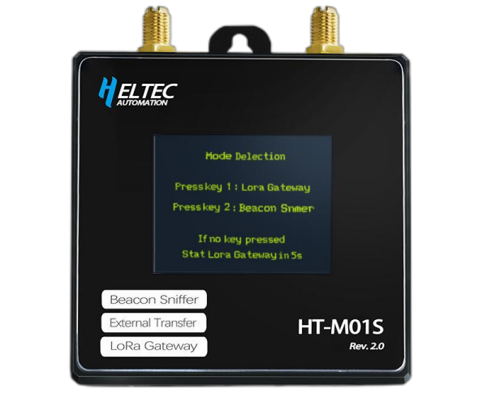
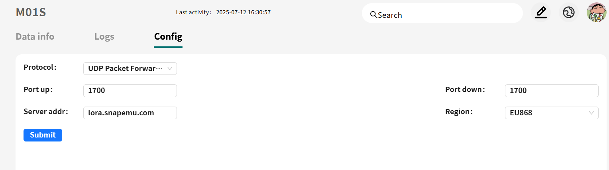
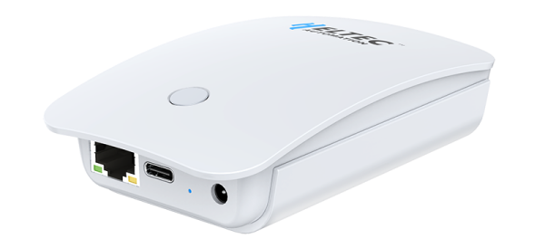

import Tabs from '@theme/Tabs';
import TabItem from '@theme/TabItem';
import styles from '@site/src/css/styles.module.css';

# How to Remotely Manage Gateway

This solution addresses the limitations of traditional gateways, such as limited coverage and complex deployment. With remote management, users can configure, upgrade, monitor, and troubleshoot gateways without on-site visits, improving efficiency while reducing costs and response time. It is ideal for large-scale or distributed scenarios, including smart cities, industrial parks, and remote environmental monitoring.

<Tabs
groupId="gateway"
queryString="gateway"
defaultValue="gateway"
className={styles.customTabs}
values={[
{label: 'HT-M02', value:'gateway'},
{label: 'HT-M01S', value:'htm01s'},
{label: 'HT-M7603 ', value:'htm7603'},
]}>

<TabItem value="gateway">

  

1. After completing the M02 gateway configuration as described in this [document](/docs/devices/lora-gateway/ht-m02_v2/quick_start), enter SSH mode and execute the following command to update the gateway: rm -rf update_M02* && wget http://minerback.heltec.cn/download/update_M02.sh && chmod +x update_M02.sh && ./update_M02.sh.
2. Once the update is complete, return to the configuration interface, go to the Remote Control section, select “Enable”, and click “Apply”.
3. Next, follow the instructions in this manual to register the gateway on the SnapEmu platform. After successful registration, click Configure to enable remote management of the gateway.

</TabItem>
<TabItem value="htm01s" >

  

1. Configure the HT-M01S gateway according to this [manual](/docs/devices/lora-gateway/ht-m01s_v2/quick_start). After completing the configuration, select “Firmware Update” and upload the M01S firmware. The system will automatically redirect to a new configuration page.
2. On this page, click “SPIFFS Update” and upload the M01S_SPIFFS firmware. Then, go to “Device Management” and enable the Remote Management feature.
3. Finally, follow the instructions in this manual to register the gateway on the SnapEmu platform. Once registration is successful, click “Configure” to activate remote management.

</TabItem>
<TabItem value="htm7603" >

  

1. After completing the 7603 gateway configuration as described in this [document](/docs/devices/lora-gateway/ht-m7603/), enter SSH mode and execute the following command to update the gateway: rm -rf update_M7603* && wget http://minerback.heltec.cn/download/update_M7603.sh && chmod +x update_M7603.sh && ./update_M7603.sh
2. Once the update is complete, return to the configuration interface, go to the Remote Control section, select “Enable”, and click “Apply”.
3. Next, follow the instructions in this manual to register the gateway on the SnapEmu platform. After successful registration, click Configure to enable remote management of the gateway.

</TabItem>
</Tabs>
