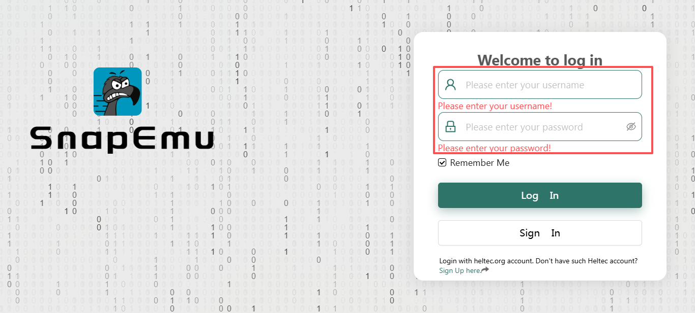
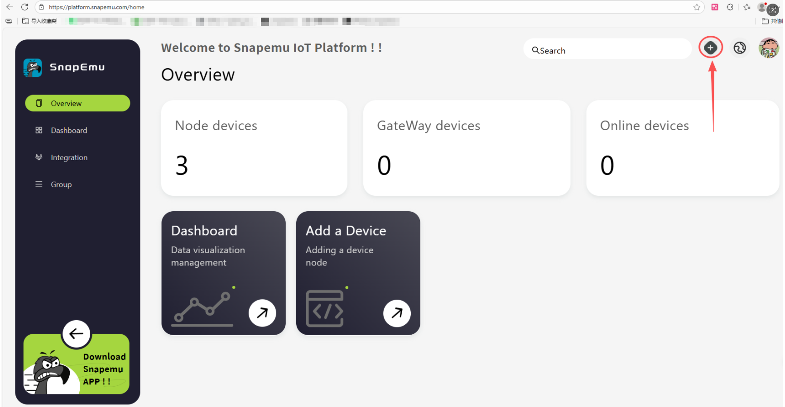
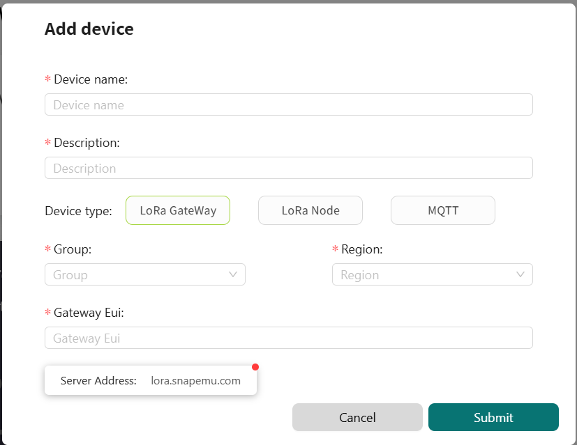
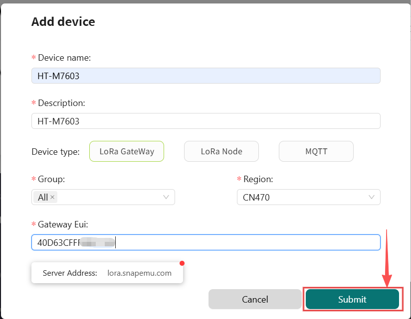
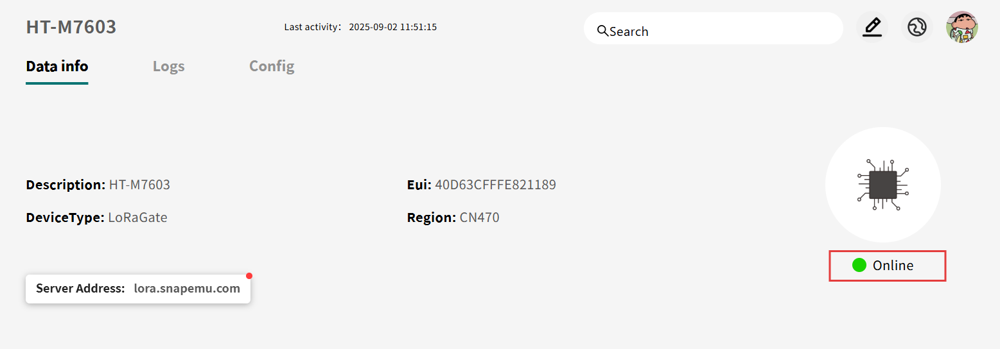
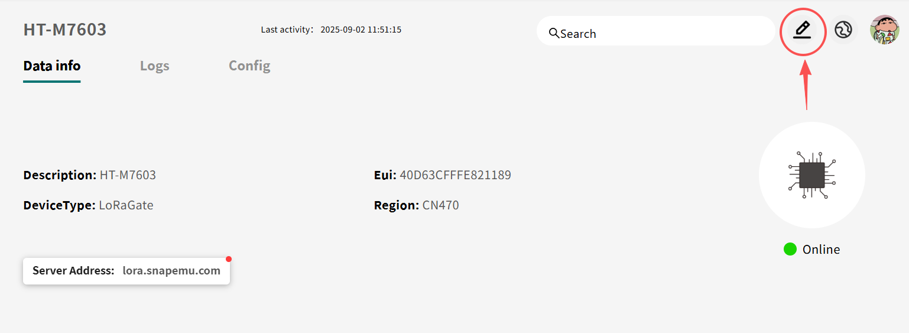
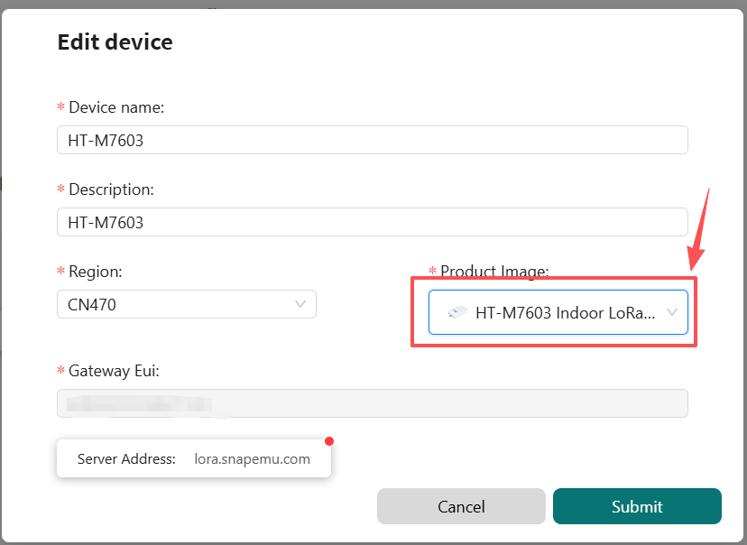

import Tabs from '@theme/Tabs';
import TabItem from '@theme/TabItem';
import styles from '@site/src/css/styles.module.css';
import DocCard from '@theme/DocCard';

# How to Gateway Register on Snapemu

:::tip
The server address for Snapemu is `lora.snapemu.com`
:::

<Tabs
groupId="gateway"
queryString="gateway"
defaultValue="gateway"
className={styles.customTabs}
values={[
{label: 'HT-M02', value:'gateway'},
{label: 'HT-M01S', value:'htm01s'},
{label: 'HT-M2802 ', value:'htm2802'},
{label: 'HT-M7603 ', value:'htm7603'},
]}>

<TabItem value="gateway">

## Heltec HT-M02_v2 Connect to Snapemu

Firstly, users can quickly configure the gateway according to [this document](/docs/devices/lora-gateway/ht-m02_v2/quick_start).

## Register a LoRa gateway in Snapemu

User log in to [Snapemu](https://platform.snapemu.com) by using their Heltec website account.

After the user successfully logs in, this interface will be displayed. Click to `+`.

Select device type and fill in configuration information on this interface.

- `device name` and `description` can be filled in freely, and they will become the name and remark of the device displayed on the platform. 
- `Group` denotes the grouping of the device on SnapEmu.
- `device type` This device is a gateway, so choose "LoRaGateway".
- `Region` Match the frequency band of the gateway.
- `GatewayEUI` Gateway ID, through device configuration page or scan the device QR code to obtain.

After filling in the information, click Submit and refresh the page to see the device. 

After successful device registration, the device status will display `online`.

Then click here to select the corresponding product image.

If everything goes smoothly, it will be as shown in the picture.

</TabItem>
<TabItem value="htm01s" >

## Heltec HT-M01s_v2 Connect to Snapemu

Firstly, users can quickly configure the gateway according to [this document](/docs/devices/lora-gateway/ht-m01s_v2/quick_start).

## Register a LoRa gateway in Snapemu

User log in to [Snapemu](https://platform.snapemu.com) by using their Heltec website account.

After the user successfully logs in, this interface will be displayed. Click to `+`.

Select device type and fill in configuration information on this interface.

- `device name` and `description` can be filled in freely, and they will become the name and remark of the device displayed on the platform. 
- `Group` denotes the grouping of the device on SnapEmu.
- `device type` This device is a gateway, so choose "LoRaGateway".
- `Region` Match the frequency band of the gateway.
- `GatewayEUI` Gateway ID, through device configuration page or scan the device QR code to obtain.

After filling in the information, click Submit and refresh the page to see the device. 

After successful device registration, the device status will display `online`.

Then click here to select the corresponding product image.

If everything goes smoothly, it will be as shown in the picture.

</TabItem>
<TabItem value="htm2802" >

## Heltec HT-M2802 Connect to Snapemu

Firstly, users can quickly configure the gateway according to [this document](/docs/devices/lora-gateway/ht-m2802/quick_start).

## Register a LoRa gateway in Snapemu

User log in to [Snapemu](https://platform.snapemu.com) by using their Heltec website account.

After the user successfully logs in, this interface will be displayed. Click to `+`.

Select device type and fill in configuration information on this interface.

- `device name` and `description` can be filled in freely, and they will become the name and remark of the device displayed on the platform. 
- `Group` denotes the grouping of the device on SnapEmu.
- `device type` This device is a gateway, so choose "LoRaGateway".
- `Region` Match the frequency band of the gateway.
- `GatewayEUI` Gateway ID, through device configuration page or scan the device QR code to obtain.

After filling in the information, click Submit and refresh the page to see the device. 

After successful device registration, the device status will display `online`.

Then click here to select the corresponding product image.

If everything goes smoothly, it will be as shown in the picture.

</TabItem>
<TabItem value="htm7603" >

## Heltec HT-M7603 Connect to Snapemu

Firstly, users can quickly configure the gateway according to [this document](/docs/devices/lora-gateway/ht-m7603/).

## Register a LoRa gateway in Snapemu

User log in to [Snapemu](https://platform.snapemu.com) by using their Heltec website account.

After the user successfully logs in, this interface will be displayed. Click to `+`.

Select device type and fill in configuration information on this interface.

- `device name` and `description` can be filled in freely, and they will become the name and remark of the device displayed on the platform. 
- `Group` denotes the grouping of the device on SnapEmu.
- `device type` This device is a gateway, so choose "LoRaGateway".
- `Region` Match the frequency band of the gateway.
- `GatewayEUI` Gateway ID, through device configuration page or scan the device QR code to obtain.

After filling in the information, click Submit and refresh the page to see the device. 

After successful device registration, the device status will display `online`.

Then click here to select the corresponding product image.

If everything goes smoothly, it will be as shown in the picture.

</TabItem>
</Tabs>