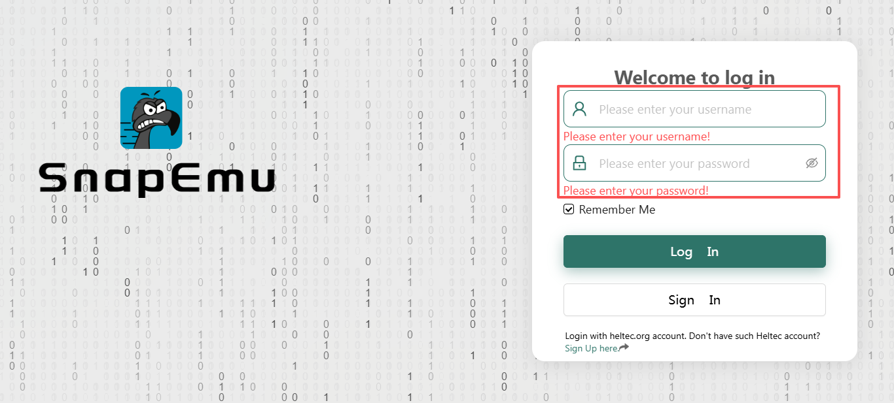
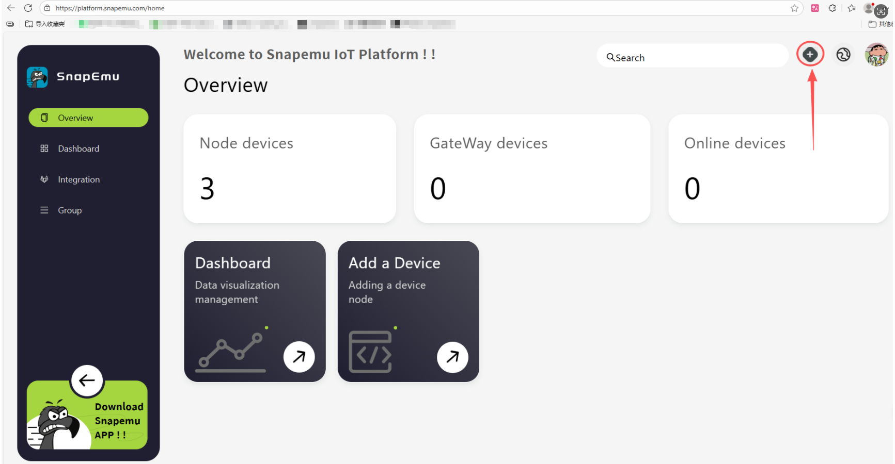

# How to Node Register on Snapemu

## Taking Heltec WiFi LoRa 32 V3 connected to Snapemu as an example

## Register a LoRa Node on Snapemu

User log in to [Snapemu](https://platform.snapemu.com) by using their Heltec website account.

After the user successfully logs in, this interface will be displayed. Click to `+`.

Select device type and fill in configuration information on this interface.

- `device name` and `description` can be filled in freely, and they will become the name and remark of the device displayed on the platform. 
- `group` denotes the grouping of the device on SnapEmu.
- `Device type` This device is a node, so choose "LoRaNode".
- `Region` Match the frequency band of the LoRaNode.
- `jointype`  All choose OTAA mode
- `Appeui` and `Deveui`  and `AppKey`   need to match the LoRaWAN code, which can be customized by the user. When registering, only the numerical value needs to be filled in. 

:::tip
- During node registration, make sure that the AppEUI, DevEUI, and AppKey are identical to those defined in the LoRaWAN code.
- The node’s Region setting matches the Region configured on the gateway.
:::

After running the lorawan code, the device will be automatically activated, and if everything goes smoothly, it will be as shown in the figure. Then click here to select the corresponding product image.

