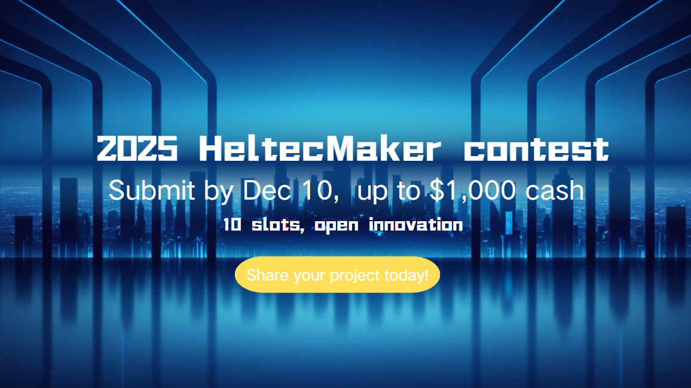

The 2025 Heltec Maker Challenge is here—our very first global maker contest! 🚀

We’re inviting makers from around the world to showcase your ideas and projects using Heltec hardware. Whether it’s a warpped project or something still in development, from individual to groups, we want to see how you envolving us. Our mission for this contest is simple: encouraging more makers to join our community and celebrating creative explorations. The contest is open-minded and boundary-breaking, you have the freedom to share your vision and spirit.

<!-- truncate -->

We’ve set up 10 prize-winning spots, and for whom participate this contest have the exclusive discounts.

🎁Hopefully, winners will receive their exclusive gifts just in time for Christmas!

**So… are you ready to take the challenge?**

## Who Can Participate:
- Open to individuals or teams.
- Any project using Heltec series products is eligible—past or present.
- **This contest can be based on DIY works of Heltec's Maker products, or it can be based on Heltec's application products. we welcome all creative ideas, including but not limited to:**
  - Wireless & IoT networks (LoRa/LoRaWAN, gateways, mesh networks)
  - Smart agriculture (environment monitoring, automatic irrigation, data-driven farming)
  - Home/industrial automation (smart home control, automated monitoring systems)
  - Weather & environmental monitoring (mini weather stations, sensor clusters)
  - Health & education (wearables, remote teaching tools)
  - Other innovative applications (robotics, intelligent transportation, energy management, consumer electronics, etc.)

:::note
Please make sure that you are using at least one heltec product in your project!
:::

:::tip
To sum it up... The key logic is what did you do based on Heltec's products, how did you achieve it, what problems did you ultimately solve, and what goals did you achieve.
:::

## How to participate
- Submit apply on this page: 
- Submit a PR in the following GitHub repository:
- Then wait for our review. Those that pass the review will be merged into PR and displayed on this page.

## Timeline: 
1️⃣ Registration & Project Submission (Sep 20 – Dec 10)
- Participants may register and submit their projects anytime during this period.
- All final proposals must be submitted by Dec 10.
:::tip
Every submitted project receives a 30% discount on physical device purchases (limited to one use per participant).
:::

2️⃣ Project Evaluation (Dec 10 – Dec 15)
- Submissions will be reviewed and evaluated.

3️⃣ Rankings Announcement: Dec 15

4️⃣ Awards (Dec 15 – Dec 24)
- Prizes will be distributed within 7–15 days — just in time to become a special Christmas gift.

## Judging & Evaluation

The evaluation results will be jointly decided by community votes, the Heltec team, and invited experts.

## Awards

### Participation Reward:
- All projects passing preliminary review receive a certificate and commemorative gift.

### Prizes:
- 1st Place (1 winner): $1,000 + trophy + Honor Wall
- 2nd Place (1 winner): $800 + trophy + Honor Wall
- 3rd Place (1 winner): $500 + trophy + Honor Wall
- 4th–6th Place: $300 each
- 7th–10th Place: $100 each

:::note
Prizes are per project, not per individual. A team of 5 winning first prize still receives $1,000.
:::

## How the Contest Works

Step 1: Registration & Project Submission (Sep 20 – Dec 10)
- Submit your project including all the details, can be various format, pics, screenshots,  URL, blog, or the others.

Step 2: Start Your Project
- Create a Hackster project (or equivalent) to document your design, concept, and technical narrative.

Step 3: Submit Proposal
- Complete the official contest questionnaire and submit your project URL.
- Every submitted project receives a 30% discount on physical device purchases (limited to one use per participant).

Step 4: Top Contenders Selected
- The top 10 proposals will be chosen for novelty, creativity, and documentation quality. Each contender earns a base award after delivering their solution.

Step 5: Prototype Validation
- Contenders must test their designs on physical Heltec hardware, refine as needed, and update project documentation with validation results.

Step 6: Community Voting
- Community support contributes 60% of the bonus award. Gather votes via social networks and project platforms. Voting closes on December 5, 2025, 23:59 CST.

Step 7: Final Submission
- Submit your fully documented project for final judging. Bonus awards recognize exceptional innovation, creativity, and community engagement.
Additional Notes.
- Submission Requirements: Ensure all files comply with size, format, and submission instructions. Projects must be original, respect third-party rights, and comply with Heltec contest rules.
- Copyright & IP: By submitting, participants agree to Heltec’s right to promote, display, and share project content.
- Promotion: Heltec will showcase projects via official website, partner media, and social channels; participants are encouraged to share their journey online to maximize exposure.