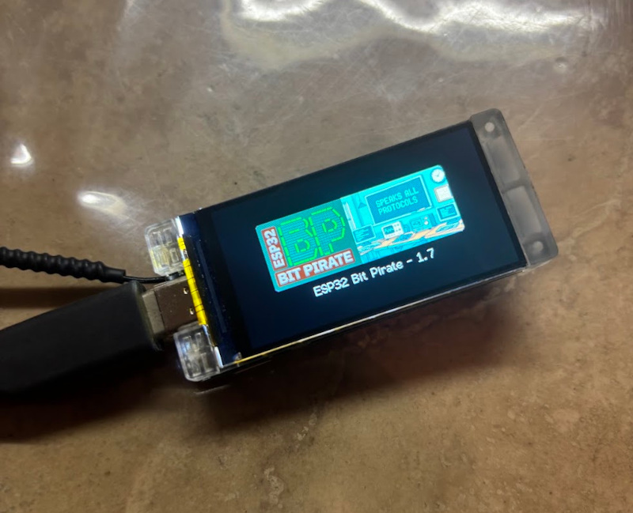
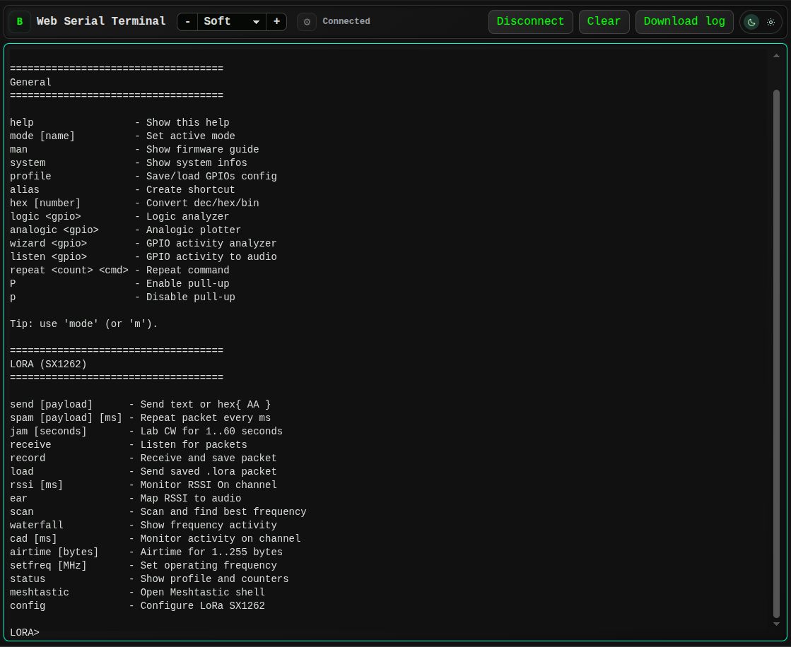
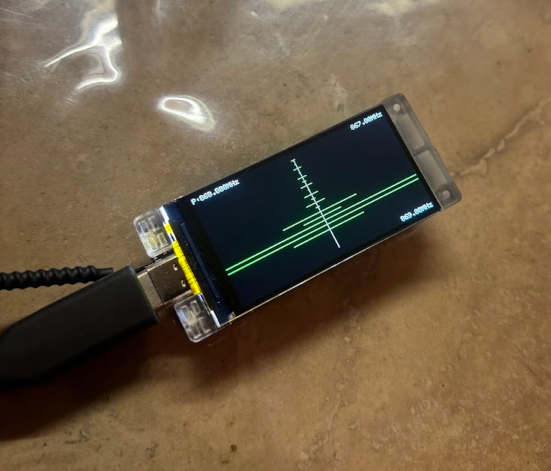

An ESP32-S3 development board is usually the device being developed. **ESP32 Bit Pirate flips that idea around:** flash it once, and the board itself becomes part of your electronics workbench.

The open-source firmware provides a common command-line interface for interacting with I2C, SPI, UART, GPIO and many other wired and wireless protocols. Around that firmware is a set of browser tools for flashing, serial access, logic capture, memory programming and Python automation.

With **ESP32 Bit Pirate 1.7**, this workflow now supports the **[Heltec WiFi LoRa 32 V4](https://heltec.org/project/wifi-lora-32-v4/)** and the **[Heltec Vision Master T190](https://heltec.org/project/vision-master-t190/)**, including direct access to the **SX1262 LoRa radio** on the supported LoRa configurations.

That makes these boards useful for something slightly different from their usual role: instead of only building a LoRa application *with* them, you can also use them to **develop, inspect and debug other hardware**.

<!-- truncate -->

### One board instead of a collection of small test sketches

Embedded development often begins with a simple question:

> Is the problem in my firmware, the wiring, the peripheral, or the radio configuration?

Answering that question usually means opening several tools or writing temporary sketches: an I2C scanner, a UART bridge, an SPI flash reader, a GPIO test program, a LoRa transmitter, a logic analyzer capture, and so on.

ESP32 Bit Pirate tries to remove that repeated setup work. The firmware stays on the board and you select the interface you need at runtime.

For example, the same Heltec board can be used to:

- scan an I2C bus and inspect device registers;
- communicate with SPI peripherals or memory chips;
- bridge, monitor or test UART devices;
- read and drive GPIOs, PWM and digital signals;
- inspect JTAG/SWD targets and CAN buses;
- work with infrared and supported radio modules;
- analyze LoRa traffic through the onboard SX1262;
- expose dedicated USB adapter modes to desktop or browser tools;
- automate repeatable hardware tests from Python.

The objective is not to replace every laboratory instrument. It is to make **many common embedded debugging tasks immediately available from one inexpensive board and one interface**.

### Why the Heltec boards are a particularly good fit

The two Heltec targets added in v1.7 combine an ESP32-S3 with useful hardware around it, but they lend themselves to slightly different bench roles.

| Board | What makes it interesting for ESP32 Bit Pirate |
| --- | --- |
| **WiFi LoRa 32 V4** | Compact ESP32-S3 + SX1262 platform with many exposed interfaces. It works well as a small USB-connected bench tool while keeping LoRa available without an external radio module. |
| **Vision Master T190** | ESP32-S3 platform with a 1.9-inch TFT display and, on the LoRa-equipped version, an SX1262. The display makes local status and radio visualizations possible directly on the device. |

Support is integrated into the normal ESP32 Bit Pirate firmware, so the board definition already knows how to access the onboard LoRa hardware. There is no need to wire a separate SX1262 module just to use the LoRa mode.

### The SX1262 becomes a LoRa debugging instrument

The largest Heltec-specific addition in v1.7 is the new **LoRa mode**.

Instead of providing only basic send/receive examples, the mode is designed around the kinds of operations that are useful when something on a LoRa link is not behaving as expected.



*The LoRa mode exposed through the browser-based Web Serial Terminal.*

The main workflows include:

| Task | ESP32 Bit Pirate tools |
| --- | --- |
| Transmit and receive packets | `send`, `receive` |
| Check signal level and channel activity | `rssi`, `cad` |
| Search for activity | `scan`, `waterfall` |
| Save and reproduce a packet | `record`, `load` |
| Change the radio configuration | `config`, `setfreq` |
| Inspect current state | `status` |
| Work with Meshtastic-compatible traffic | `meshtastic` |

The `config` interface exposes the parameters that most often explain interoperability problems between LoRa devices: frequency, bandwidth, spreading factor, coding rate, preamble, sync word, TX power and the SX1262 pin configuration.

That turns a debugging session into something much more direct. If a node is expected to transmit but nothing is received, you can first inspect RSSI, scan the nearby frequency range, visualize activity, verify the radio parameters and only then move to packet decoding.

A typical session can be as simple as:

```text
mode lora
status
scan
waterfall
receive
```

If activity appears but packets still do not decode, the radio configuration can be adjusted without recompiling a test application. Once a useful packet is received, it can be recorded to the filesystem and replayed later with its associated radio configuration.

This is the important difference between a demo sketch and a debugging tool: **the workflow stays interactive while the problem is being investigated**.

### A small visual RF tool on the Vision Master T190

The Vision Master T190 adds another useful dimension because ESP32 Bit Pirate can use its integrated TFT for local feedback.



*Frequency activity visualized directly on a Vision Master T190.*

For radio work, this means the board does not always need to be treated as a headless USB device. Frequency activity can be displayed directly on the screen while the serial interface remains available for more detailed control.

It is a simple feature, but it changes the character of the board: the T190 starts to behave more like a compact handheld diagnostic instrument than a conventional development board.

### Meshtastic analysis without turning the tool into a Meshtastic node

The Heltec boards are widely used with Meshtastic, so v1.7 also includes a dedicated **Meshtastic analysis shell** inside the LoRa mode.

ESP32 Bit Pirate is **not intended to replace the normal Meshtastic firmware**. The purpose of this shell is different: it lets the board remain a debugging instrument while providing tools to send, receive and inspect Meshtastic-compatible packets.

This is useful when investigating questions such as:

- Is the radio configured with the expected preset?
- Is there traffic on the channel?
- Can the hardware receive packets at all?
- Does changing frequency or radio parameters change the result?
- Is the problem on the RF side or elsewhere in the prototype?

Once the radio side is understood, the same board can immediately switch to UART, I2C, SPI or GPIO work to continue debugging the rest of the system.

### LoRa is only one mode

The new SX1262 support is what makes v1.7 particularly relevant to Heltec users, but it sits inside a much larger firmware.

A useful way to look at ESP32 Bit Pirate is not as a list of protocols, but as a collection of **bench problems it can solve**:

| When you need to... | You can use... |
| --- | --- |
| Find an unknown sensor on a board | I2C scan, register and raw-read tools |
| Inspect or back up an SPI NOR flash | SPI mode or the browser SPI Flash Programmer |
| Read boot logs or interact with a serial console | UART mode / USB-UART workflows |
| Check a pin, pulse a line or generate PWM | DIO/GPIO tools |
| Capture digital timing | SUMP-compatible logic analyzer workflow |
| Probe JTAG/SWD connectivity | JTAG/OpenOCD workflows |
| Explore supported wireless interfaces | LoRa, Wi-Fi, BLE, Sub-GHz, RF24 and others depending on the hardware |
| Repeat the same test many times | BPIO2 or Python automation |

Other firmware modes cover 1-Wire, 2-Wire, 3-Wire, CAN, I2S, infrared, USB, Ethernet, LED control and additional hardware interfaces.

The advantage is continuity: once you know the command structure, moving from one bus to another does not require starting a new Arduino project for every experiment.

### The browser is part of the workbench

ESP32 Bit Pirate has gradually evolved from a firmware repository into a broader ecosystem, and this is one of the most useful aspects of the project for quick hardware work.

The **[Web Flasher](https://geo-tp.github.io/ESP32-Bit-Pirate/webflasher/)** installs the firmware on supported boards directly from a compatible browser. After flashing, the **[Web Serial Terminal](https://geo-tp.github.io/ESP32-Bit-Pirate/web-tools/)** exposes the firmware CLI without requiring PuTTY, minicom or another serial application.

From the same Web Tools section, the board can also be used with dedicated interfaces for tasks such as:

- SPI flash programming;
- ESP32 firmware backup and flashing;
- AVR programming;
- STM32 bootloader and ST-Link workflows;
- SUMP logic capture;
- BPIO2 GPIO, I2C and SPI control.

This browser-first approach is especially useful on a machine that is not already configured as an embedded development workstation. A compatible browser, a USB cable and the board are enough to begin many common tasks.

### From an interactive test to a repeatable Python workflow

Manual commands are useful while discovering a problem. Once a sequence works, repeating the same commands by hand becomes the next problem.

For that reason, ESP32 Bit Pirate also includes a **[Python Scripting Lab](https://geo-tp.github.io/ESP32-Bit-Pirate/web-tools/python-lab/)**. Python code can be written and executed from the browser while communicating with the device through Web Serial.

This makes it possible to start with an interactive session and gradually turn it into a repeatable test:

1. explore the hardware manually;
2. find the sequence that produces the expected result;
3. automate the sequence in Python;
4. reuse it for validation, logging or regression testing.

The same principle is used by the BPIO2 adapter added in v1.7, which provides host-controlled GPIO, I2C and SPI operations and now has its own browser controller.

### What v1.7 adds beyond Heltec support

The 1.7 release is not only a board-support update. It also includes several improvements to the wider workbench:

- a new SX1262 LoRa mode with RF analysis and Meshtastic tooling;
- native Heltec WiFi LoRa 32 V4 and Vision Master T190 support;
- a BPIO2 USB adapter and browser controller for GPIO/I2C/SPI automation;
- improved SPI flash transfer handling;
- an I2C raw-read fallback for devices without a traditional register interface;
- a larger infrared raw receive buffer for longer signals;
- reliability, USB handling and resource-management fixes.

Together, these changes follow the direction of the project: **keep the firmware interactive, make specialized tools available from the browser, and make successful manual workflows easy to automate.**

### Getting started on a Heltec board

The shortest path is:

1. Open the **[ESP32 Bit Pirate Web Flasher](https://geo-tp.github.io/ESP32-Bit-Pirate/webflasher/)**.
2. Select the supported Heltec target and flash the firmware.
3. Open the **[Web Tools](https://geo-tp.github.io/ESP32-Bit-Pirate/web-tools/)** page and connect through Web Serial.
4. Run `mode` to choose the interface you want to use.
5. For LoRa work, enter the LoRa mode and start with `status`, `scan` or `receive`.

The full project website brings together the firmware, board guides, practical recipes, Web Tools and documentation:

- **Project website:** [https://geo-tp.github.io/ESP32-Bit-Pirate/](https://geo-tp.github.io/ESP32-Bit-Pirate/)
- **GitHub repository:** [https://github.com/geo-tp/ESP32-Bit-Pirate](https://github.com/geo-tp/ESP32-Bit-Pirate)
- **v1.7 release:** [https://github.com/geo-tp/ESP32-Bit-Pirate/releases/tag/v1.7](https://github.com/geo-tp/ESP32-Bit-Pirate/releases/tag/v1.7)
- **LoRa documentation:** [https://github.com/geo-tp/ESP32-Bit-Pirate/wiki/24-LORA](https://github.com/geo-tp/ESP32-Bit-Pirate/wiki/24-LORA)
- **Practical recipes:** [https://geo-tp.github.io/ESP32-Bit-Pirate/recipes/](https://geo-tp.github.io/ESP32-Bit-Pirate/recipes/)
- **Heltec WiFi LoRa 32 V4:** [https://heltec.org/project/wifi-lora-32-v4/](https://heltec.org/project/wifi-lora-32-v4/)
- **Heltec Vision Master T190:** [https://heltec.org/project/vision-master-t190/](https://heltec.org/project/vision-master-t190/)

ESP32 Bit Pirate does not change what these Heltec boards are capable of at the hardware level. What it changes is **how quickly that hardware can be repurposed**.

A board that was a LoRa node a few minutes ago can become an RF test tool, a serial bridge, an I2C/SPI workbench, a logic capture interface or the controller for an automated hardware test — without building a new utility from scratch each time.

> **Safety note:** use only voltage levels compatible with the ESP32 and connected hardware. Radio features must be used on frequencies, power levels and systems permitted in your region and only on equipment you are authorized to test.
