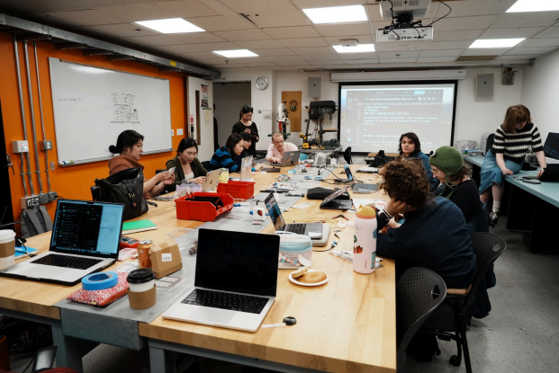
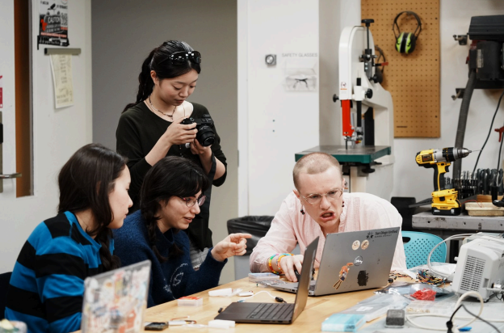
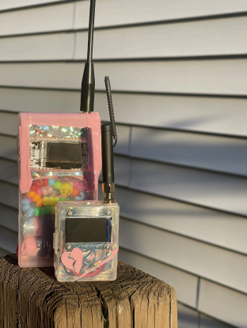
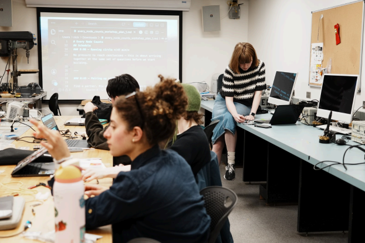
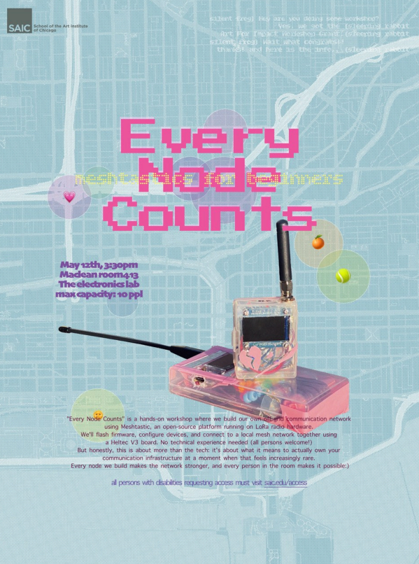

## About the workshop

Every Node Counts brought together around a dozen students from across the School of the Art Institute of Chicago for one shared question: at a moment when almost all of our communication runs through infrastructure we don't own, what does it take to build a network of our own?

The workshop was selected by SAIC's Student Government through a competitive Art for Impact grant, and it was open to everyone - no prior electronics experience required. Over a single afternoon, participants went from "what is a mesh network?" to holding a working, off-grid radio node they had flashed and configured themselves. The whole workshop was built around the [**Heltec LoRa 32 V3**](https://heltec.org/project/wifi-lora-32-v3/), an affordable, all-in-one board that let complete beginners hold a working node in a single afternoon.

We built together rather than working alone. Meshtastic is a network that gets stronger with every device added to it, so the room worked the same way: people who finished first turned around and helped their neighbors. By the time the last node came online, nobody had gotten there entirely by themselves.

For us the point was never only the device. In these precarious times it felt important to make something together - to build local community, to have the kind of rich conversations that don't happen often, and to think about what it means to spend time outside the large data networks we're usually placed inside. It was, simply, a beautiful afternoon.

*Pairing up to flash firmware and work through the radio settings together.*

## The build

Participants flashed Meshtastic firmware onto their boards over USB-C, set their region and channel, gave each node its own name and identity, and joined a shared local mesh. The moment a neighbor's message first appeared on their own screen was, every time, the moment it clicked.

## Working with the Heltec V3

At the center of every build was the [**Heltec LoRa 32 V3**](https://heltec.org/project/wifi-lora-32-v3/). For a room of first-time makers it worked out well: the board arrives with the ESP32, the SX1262 LoRa radio, USB-C, battery management, and a small OLED display already integrated, so participants had a complete, self-contained node the moment they plugged in - nothing to wire up or solder.

Flashing Meshtastic onto the V3 was straightforward even for people who had never used a microcontroller: connect over USB-C, flash the firmware, and the onboard OLED immediately confirms the node is alive. That instant feedback mattered - seeing their own name and node ID appear on the little screen was the moment mesh networking stopped being abstract. The built-in display also meant nobody was flying blind out in the field, with signal, battery, and messages all readable right on the device.

*A finished node, housed in a hand-decorated case with beads and a broken-heart charm.*

*The build plan projected in the lab during the workshop.*

*Workshop poster, designed by Helen Janjaa Lee.*

## Thank you

Thank you to Heltec for supporting Every Node Counts. The boards were the heart of the workshop, and the beginner-friendliness of the V3 is a big part of why a room of artists with no electronics background left as node operators. We're hoping to grow this into an ongoing mesh-networking group on campus, and we'd love to stay in touch as it develops.

## Acknowledgements

Every Node Counts was made possible by the Art for Impact grant from SAIC Student Government, and by the ATSP faculty, who supported the workshop and provided the space and facilities. With gratitude to Heltec for their material support. Photographs by Doug Rosman. Poster design by Helen Janjaa Lee. A workshop by Nickii Schamborski and Helen Janjaa Lee.

 